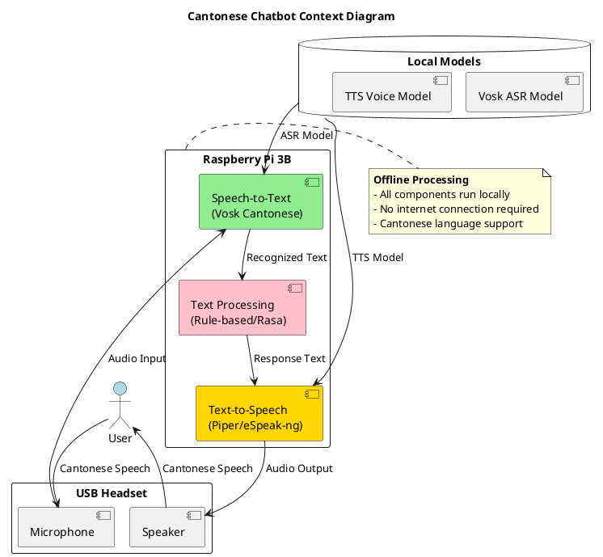

# 3D AI Sculpture
---

## What is this?

Combining Art and Technologies, this project is bringing your 3D sculpture to live with GenAI. You will unleash your creativity to create your favorite 3D sculpture using just an iPAD, and then give it a soul by using GenAI. So it can talk and interact with you. Learners can explore:

- 3D modelling in particular sculpting
- Post processing and color of 3D model
- Build AI powered chatbot
    - Speech Reconition model
    - Text to Speech model
    - AI response using LLM or AI generated rule based response
- Raspberry Pi 
- Coding in Python

### Key Features:

- Base framework / model to build around the technology
-  


The 3D Sculpt AI project acts as a powerful educational resource, enabling learners to grasp essential art principles, foundational concepts in AI, and the intricate connections between technology and art.

---

## What you will learn
- **AI Principles**: Understanding how AI can be used in design
- **Creativity**: Exploring the role of technology in artistic expression
- **3D Modeling**: Techniques for creating and modifying 3D models
- **3D Printing**: Basics of 3D printing technology and processes
- **Problem Solving**: Iterative design and troubleshooting in 3D deling
- **Teamwork**: Collaborative design and sharing of ideas
- **STEM Integration**: Connecting technology concepts with real-world applications

### What you need

**Hardware**

| Component        | Minimum Specs                     | Recommended Specs                | Notes                                                        |
|------------------|-----------------------------------|----------------------------------|--------------------------------------------------------------|
| Raspberry Pi     | Raspberry Pi 3B                   | Raspberry Pi 4 (4GB or 8GB)     | Pi 4 is recommended for better performance with Whisper.     |
| MicroSD Card     | 8GB (Class 10)                    | 16GB or 32GB (Class 10 or higher) | Larger cards provide more storage for models and swap space. |
| Power Supply      | 5V/2.5A                          | 5V/3A                            | A stable power supply is crucial for reliable operation.      |
| USB Headset      | Any USB headset with microphone    | Jabra, Logitech, or similar     | Ensure the headset is compatible with Raspberry Pi.          |
| Cooling          | Passive heatsink                  | Active cooling (fan)            | Prevents thermal throttling, especially on Pi 4.            |
| External Storage | Not required                       | USB SSD or HDD (optional)      | Useful for storing larger Whisper models (e.g., small or medium). |
| Network          | Wi-Fi or Ethernet                  | Ethernet for stable connection   | Required for initial setup and optional for cloud-based services. |
| Case             | Basic case                        | Case with cooling and GPIO access | Protects the Pi and improves thermal management.              |


**Software**

| Software            | Purpose                          | Installation Command                                           | Notes                                                        |
|---------------------|----------------------------------|--------------------------------------------------------------|--------------------------------------------------------------|
| Raspberry Pi OS     | Operating system                 | Pre-installed or download from raspberrypi.org               | Use the Lite version for headless setups.                   |
| Python 3            | Programming language             | Pre-installed or sudo apt install python3                   | Ensure Python 3.7 or higher is installed.                    |
| pip                 | Python package manager           | sudo apt install python3-pip                                 | Required for installing Python libraries.                    |
| Whisper             | Speech-to-text (STT)            | pip3 install openai-whisper                                   | Use the tiny or small model for Raspberry Pi.                |
| PyTorch             | Machine learning framework       | pip3 install torch torchaudio --extra-index-url https://download.pytorch.org/whl/cpu | Required for Whisper.                                       |
| sounddevice         | Audio input/output library       | pip3 install sounddevice                                      | Used for recording audio from the microphone.                |
| numpy               | Numerical computing library      | pip3 install numpy                                           | Required for audio data processing.                           |
| Piper TTS           | Text-to-speech (TTS)            | pip3 install piper-tts                                       | Use a Cantonese voice model (if available).                  |
| eSpeak-ng           | Lightweight TTS (fallback)      | sudo apt install espeak-ng                                    | Supports Cantonese but has robotic voice quality.            |
| ffmpeg              | Audio processing tool            | sudo apt install ffmpeg                                       | Required for Whisper to handle audio files.                  |
| Git                 | Version control                  | sudo apt install git                                         | Optional, but useful for cloning repositories.               |
| systemd             | Service management               | Pre-installed                                                | Used to run the chatbot as a service on boot.               |
| alsa-utils          | Audio device management          | sudo apt install alsa-utils                                   | Used for configuring audio devices.                           |
| libopenblas-dev     | Optimized math library           | sudo apt install libopenblas-dev                              | Improves performance for Whisper and PyTorch.                |
| portaudio19-dev     | Audio I/O library                | sudo apt install portaudio19-dev                              | Required for sounddevice.                                    |


**Tools**

---

## How it works




### The Design Process


**3D Modeling**
   - Create and refine 3D models using software tools. Participants will learn techniques for manipulating shapes, textures, and colors to achieve desired outcomes.

**3D Printing**
   - Prepare models for printing using slicing software, which converts 3D designs into instructions for the printer. Participants will understand the importance of settings such as layer height, infill, and support structures.

**AI Elements

### Assembly Guide
For detailed assembly instructions, please refer to the [Assembly Guide](assembly-guide.md).

---

## Lesson Plan

### Course Objectives:


## How to Use PlantUML

PlantUML is a tool that allows you to create diagrams from plain text descriptions. To use PlantUML in your project, follow these steps:

1. **Install PlantUML**: You can install PlantUML via various methods, including using a package manager or downloading it directly from the [PlantUML website](http://plantuml.com/).

2. **Basic Syntax**: Here's a simple example of how to create a UML class diagram:

   ```plantuml
   @startuml
   class Car {
       +String model
       +String color
       +drive()
   }
   @enduml
   ```

3. **Rendering Diagrams**: Once you have written your PlantUML code, you can render it using a PlantUML-compatible tool or plugin in your IDE.

4. **Integration**: If you are using MkDocs, you can integrate PlantUML by using a plugin that supports rendering PlantUML diagrams directly in your documentation.

---

