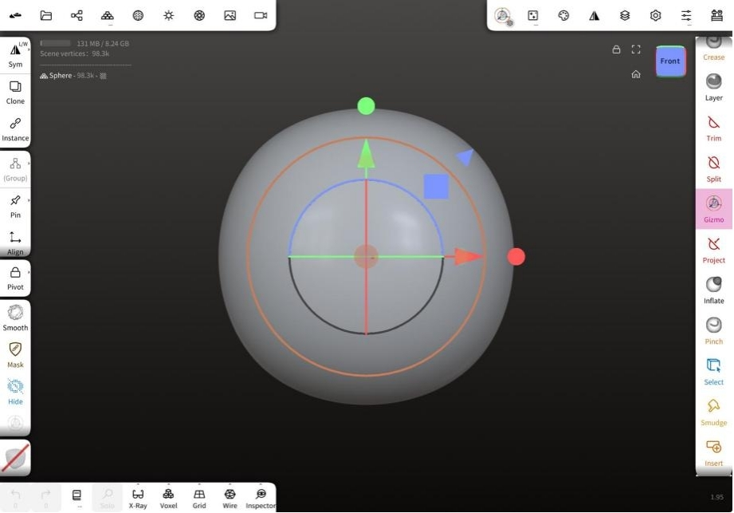

# Getting to Know Nomad Sculpt

## Welcome to Nomad! 

Nomad is a 3D sculpting app that works best on tablets with a pressure sensitive stylus, 
eg an Apple iPad and pencil, or a Samsung Galaxy Tab with stylus.

It is inspired by desktop sculpting apps like Zbrush and Blender, with a focus on an easy to understand UI, without sacrificing on features. 
If you've used 3d sculpting apps before, Nomad will feel very familiar.

If this is your first time doing 3d sculpting, then it's good to know some basics.

## Your first sculpt

When you first start Nomad you'll see a sphere on screen. Simply drag your stylus on the sphere to start sculpting. 
Symmetry is enabled by default to make sculpting easier.

## Interface

### Nav Cube

A helper to show which side of the sculpt you're viewing, as well as a shortcut to jump to different views. 
Tapping the cube will jump the view to the tapped side. Dragging the cube will rotate. 
Tap the small icons next to the cube to frame the current object or reset to the default home view.

### Three Gestures to Control the View of Screen

Drag to Rotate
Swipe to Pan
Pinch to Zoom

### Top menus

The menus in Nomad give you access to most of its features. The top-left menus mainly cover scene and object features, while the top-right menus are related to tools. On smaller screens, these menus will collapse together to save space. 

#### Stats
This section provides information about the scene, the current object, mask status, and memory usage.

### Left toolbar
Sliders for radius and intensity for most tools, context-specific buttons for other tools, and shortcuts for symmetry, the tool alt/sub mode, masking, smoothing, the gizmo, and paint options.

### Bottom toolbar
Shortcuts for commonly used features are explained below.

### Toolbox

Nomad's tools are accessible from this scrollable region.

#### Top 3 icons

- **Undo**
  
revert the last operation

- **Redo**
  
restore the last undo operation

- **History**
  
acccess history options, explained in the History menu

## Tools

### Overview

Nomad has many tools that can be broadly categorized as follows: 

- Brush tools that directly affect the surface of an object, eg Clay
- Mask tools that will protect the surface from changes, eg Mask
- Selection based tools where a 2d mask is drawn first, then an operation happens, eg Trim
- Special tools with their own interaction methods, eg Tube

Many of these tools can be customized with different brush behavior, pressure, textures etc via the Stroke menu.

### Tool controls

The panel on the left side of the screen controls the tool radius and intensity, and hotkeys specific to certain tools, explained in each tool's help section below.

#### TIP

The intensity slider for many tools can go above 100%, worth experimenting with!

### Tool context menu 

A right click or long press on a tool will bring up a context menu. 

This menu has the following options:

- **Save**
save any changes you made to the tool 
- **Clone**
duplicate the tool into a new tool shortcut
- **Last save**
revert to the previously saved version of the tool
- **Icon**
change the icon for the tool 
- **Reset**
reset the tool to its defaults

## Common Sculpting Tools

###  Clay 

The Clay tool is useful for building up your sculpture. 

**Sub** will remove material from your sculpture.

#### How Sub removes materials

###  Brush 

The standard brush. 

**Sub** will remove material.

#### How Sub removes materials

###  Move 

The area under the brush will stick to the brush, allowing for elastic deformation. The selection is maintained during the move, so if you move the brush away, then move it back where you started, you will see no deformation. 

**Normal** will move the area under the brush along the surface normal.

#### How Normal moves

###  Drag 

The area under the brush will stick to the brush, allowing for elastic deformation. Unlike the move brush, the selection is continuously updated during the stroke, so it is possible to make longer, snake like objects, especially when Dynamic Topology is activated. 

**Normal** will move the area under the brush along the surface normal.

#### How Normal moves

###  Smooth 

Smooth the area by average the point positions. This tool is highly dependent on the polygon density. So if you have many polygons, the smoothing will be less effective.

The alternate mode is the **Relax** mode, which only smooths the wireframe but tries to retain the geometric details.

#### Smooth settings

##### Sticky vertex on border

For meshes with open edges, eg a plane, it is possible to smooth out the corners. Enabling this option will lock the open edges.

##### Relax

The same as the relax alternate mode in the left-hand toolbar.

##### Stable Smoothing

Tries to make the smoothing topology independent. This works best with varying topology density and with a high smoothing intensity value.

##### TIP

Higher polygon densities can require raising the intensity above 100%. Very high   values (300%, 500%) can also work well as a sculpting tool, forcing areas to go flat and smooth quickly under the brush, like hitting clay with a mallet!

###  Mask 

This tool lets you mask points. Masked vertices can't be sculpted or painted afterwards, this is a way to "protect" areas. 

**Unmask** will erase where the mask has been painted.

#### Mask settings

A toolbar will appear at the top of the viewport with extra controls:

- **Clear**
Clear the mask					
- **Invert**
Invert the mask
- **Blur**
Blur the mask edge				
- **Sharpen**
Sharpen the mask edge

##### Quick gesture

4 gestures while holding the quick masking button:

- **Clear**
Drag on the background
- **Invert**
Tap on the background			
- **Blur**
Tap on masked area				
- **Sharpen**
Tap on unmasked area

Masks can also be used to extract geometry. The **Carve**, **Extract** and **Split** buttons will create new shapes from the masked region. The following settings offer more control:

##### Thickness
  
The distance of the extraction. Use the ± button to set the distance to be positive, negative, or centered from the surface.

##### Smoothness
  
Will smooth the border of the extracted shape, it works better with higher polygon counts.
  
##### Extract
  
In default mode 'shell' mode, behave like an extrude in other 3d apps, pulling the mask section out from the surface.
  
##### Split
  
Will extract the masked region into a new shape, but also apply an operation to the unmasked region. By default ths operation is   'shell', resulting in a fat extruded mask and a matching unmasked shape.
  
##### Carve
  
In default mode, behave a if you had trimmed into the surface by the 'thickness' amount, like cutting a section of orange peel.

###  Selector Mask 

This tool is mostly similar to the **Masking tool**, the main difference is that you don't use stroke to paint mask, but instead use the **shape selector**.

Selector mask shares the same tool settings as the **Mask** tool.

#### Shape selector

The **Trim**, **Split**, **Project**, **Facegroup** and **Hide** tools all use similar controls for selecting areas of the mesh, and are chosen with the shape selector panel on the left of the screen.

##### Lasso
A freehand drawn shape

##### Polygon
An enclosed shape defined by a combination of curves and/or straight lines. See **Shape editing** below for more info.

##### Curve		(Project only) 
A freehand curve for the projection

##### Path		(Project only)
A curve defined by points. See **Shape editing** below for more info.

##### Line
Drag a line to define a planar segment. By default it will operate on the mesh immediately, turn off auto validate if you don't want this (long press or swipe on the line icon)

##### Rect
Drag a diagonal line, this will define the corners of a rectangle shape. Long press or swipe to reveal options for auto validate, force to a square shape, and for the first click to be the center of the rectangle.

##### Ellipse
Drag a diagonal line, this will define the size of an ellipse. Long press or swipe to reveal options for auto validate, force to a circle shape, and for the the first click to be the center of the ellipse.

##### Flip
Invert the shape mask, or the direction of the project tool.

#### Shape editing

Polygon editing and curve editing behave in similar ways:

To start, drag a line to define 2 points, then drag out from the middle of the line to define a polygon or curve. Click on the points to toggle between smooth and sharp. Click and drag on the curve or line sections to create new points.To delete a point, drag a point into its neighbor until it turns red. The trash icon in the corner of the polygon or path icon will delete the shape.

###  Gizmo 

This tool lets you move, rotate and scale your mesh with a single tool. It also lets you do certain operatations on the scene hierarchy.

The viewport handle has the following features:

- **Move**
  Drag on the line+arrow to move on X/Y/Z. Drag on the peach dot in the middle of the gizmo to translate freely in screen-space.
  Click on the red, green, blue squares to translate on the X/Y/Z planes.
  
- **Rotate**
  Drag on the red/green/blue circles to rotate on X/Y/Z. Drag the sphere within the circles to free rotate.
  
- **Scale**
  Drag on the outer red/green/blue dots to scale on X/Y/Z. Drag on the outer red/green/blue cones to scale on the X/Y/Z planes.
  Drag on the outer peach circle to uniform scale.

#### Nodes and vertices

Every object in Nomad is made of a node and vertices:

- **Node**
The 'handle' of the object, which stores its translation, rotation, scale, called its transformation matrix.

- **Vertices**
The points that define the surface of an object, they store position and paint information.

## Top meun

### Files

The files menu allows you to save and load nomad projects, import and export 3d models, and export rendered images.

#### Project

A thumbnail is shown of the last save at the top of this menu. Clicking this thumbnail brings up a mini browser, tap twice on another project to bring up a mini menu to open, add, save, clone, rename, delete that project.

- **Save**
Save the Nomad project.
- **Save As**
Display the project browser to allow you to save the Nomad project with a new name.
- **Rename**
Display a text box to rename the current project.
- **Open**
Display the project browser to open a project.
- **Add to scene**
Display the project browser, when a project is selected it's contents will be merged with the current scene.
- **Delete**
Display the project browser, any selected projects will be deleted from the file system.
- **New**
Start a new project, if there are unsaved changes you will be asked if you want to save.

#### Import

For importing 3d files that aren't Nomad projects.

When you import an external scene file to Nomad, you can either import or add it. Adding a file will simply add the objects into the current scene. Importing a file will create a new Nomad project with the new objects in it.

Nomad can import these formats:

- **Nomad**   (.nom)	
- **glTF**    (.glb, .gltf)	
- **OBJ**     (.obj)	
- **STL**     (.stl)		
- **PLY**     (.ply)	
- **FBX**     (.fbx, experimental)

##### Advanced

Display advanced import options:

**Project (Nomad) / glTF / OBJ / STL / FBX**

- Keep topology
Nomad by default will attempt to fix problem geometry on load. 
Enabling this will stop Nomad from vertex/face reordering, removal of vertex/face duplicates, removal of unused vertices.

- Skip textures
Skip loading of textures for formats that support it like glTF

**Project (Nomad) / glTF**	

- Keep gui settings
Enable savng of the gui and project settings within the Nomad .nom or glTF file.

**OBJ**

- Split OBJ by groups
Enable splitting OBJ groups into separate objects.

- Color Space
Set the color mode interpreted from the obj as Linear, sRGB, or Auto.

**PLY**

- Color Space
Set the color mode interpreted from the ply as Linear, sRGB, or Auto.

**FBX**	

- Color Space		
Set the color mode interpreted from the obj as Linear, sRGB, or Auto.

### Scene

This menu lets you manage objects, lights, cameras and repeaters in Nomad. It displays the scene hierarchy as a tree-view, allowing you to modify many aspects of your objects. It also lets you create new objects, as well as combine and split objects in various ways.

**Shortcut bar**

#### Add menu

Add menu will create **primitives**, **groups**, **cameras**, **repeaters**, and **lights**.

#### Primitives

Primitives are basic shape types that can be adjusted using parameters. Once you have the primitive adjusted to your needs, you then 'validate' it, which bakes those parameters down into a polygon mesh that can be sculpted and painted. A primitive cannot have its parameters adjusted after it has been validated.

If you wonder what is the base mesh when you launch Nomad: 
this is a subdivided box as well. However the base mesh in Nomad doesn't use **Project on sphere**, meaning it is not perfectly round.

##### Primitive Toolbar

Once a primitive is created, a toolbar will appear to control it's parameters.

- **Validate** 	
Bake the primitive into a standard object so it can be sculpted and painted.

- **Edit** 		  
Toggle displaying the primitive gizmo. This is shown directly on the primitive to control its parameters, 
eg the cube width, or a cylinder hole radius.

- **Mirror** 	  
Toggle placing a mirror repeater above the primitive.

- **...** 		  
Displays the primitive menu.

Different primitives will have extra options on the toolbar:

- **Project** 
The sphere is constructed as a subdivided cube, as this is better for sculpting, but this means it is not perfectly round. This option option will force the shape closer to a perfect sphere. The icosahedron shares this option.

- **Cap** 
Toggle end caps on a shape, eg a cylinder can have caps on top, or bottom, or both, or none.

- **Hole** 
Toggle a hole to be created through the center of a shape. This will cycle through no holes, hole with a single radius, or hole with different radius at top and bottom.

- **Radius** 
Toggle if a cylinder should have a single radius, or a different radius at its top and bottom.

- **Disk** 
Toggle if a plane should be a 4 sided shape, or a circle shape.

The small toolbar below the main toolbar will let you toggle between the primitive gizmo and the transform gizmo.

## Common Issues and Solutions

### App Crashes
- **Solution:** Ensure your device has enough storage space, close other running applications, and restart the app.

### Performance Issues
- **Solution:** Reduce model complexity, lower brush resolution, and clear undo history.

### Tool Not Responding
- **Solution:** Check if the tool is selected properly and ensure that the app is updated to the latest version.

### Export Problems
- **Solution:** Verify the file format and ensure that the model is not too complex for the export settings.
