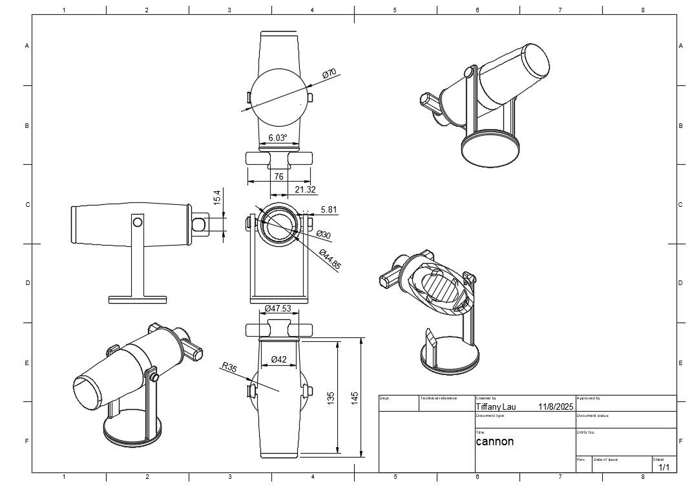
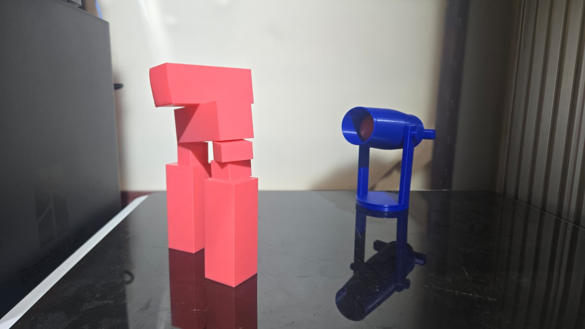

# Load, Aim, Dominate – Ping Pong Launcher Project
## Abstract

This hands-on project launches you into the world of designing, building, and firing your own ping pong launcher! You'll learn how to engineer a working tabletop launcher, fine-tune your aim, and dominate the battlefield with precision shots. This project combines creative design, practical prototyping, and a blast of competitive fun.

---

## What You Will Learn

- How to design and build your own ping pong launcher for tabletop battles
- Techniques for digital modeling and prototyping in Fusion 360
- Preparing and slicing launcher parts for 3D printing
- Fundamentals of 3D printing, assembly, and tuning for maximum firing power

## What You Will Need

| Category         | Item                                   | Notes                                 | Required/Optional |
|------------------|----------------------------------------|---------------------------------------|------------------|
| Hardware         | Laptop/Desktop                         | For digital sculpting, modelling and slicing| Required         |
|                  | FDM 3D Printer                         | e.g. BambuLab                         | Required         |
|                  | Resin 3D Printer                       | For higher detail, e.g. Phrozen       | Optional         |
| Software         | Fusion 360                             | For 3D modeling                       | Required         |
|                  | Slicing Software                       | Bambu Studio                          | Required         |
| Tools & Materials| 3D Printer Filament/Resin              | PLA                                   | Required         |
|                  | Finishing Tools                        | Sandpaper, files, rotary tool         | Optional         |
|                  | Painting Tools                         | Brushes, acrylics, pastel paints      | Optional         |

---

## Course Outline

### Chapter 1: Designing and Engineering Your Ping Pong launcher
- Overview of launcher mechanics and launching principles
- (For advanced students) Create a real-world launcher or crossbow mechanism, ensuring it fits ping pong ball dimensions
- (For intermediate students) Measure and build the launcher using provided technical drawings and templates
- Add your own creative design or modifications to the launcher frame or arms using Fusion 360

### Chapter 2: Preparing for 3D Printing
- Exporting STL files from your modeling software
- Importing into your slicer
- Configuring print settings for strong, functional parts
- Previewing and slicing the model
- 3D print your launcher components

### Chapter 3: Assembly, Tuning, and Battle-Ready Finishing
- Removing supports and cleaning the printed parts
- Sanding and smoothing surfaces for smooth operation
- Painting and decorating your launcher for style and intimidation
- Assembling and testing your ping pong launcher for maximum range and accuracy

### Chapter 4: Design a Ping Pong Battle

- Plan and set up a tabletop battlefield for your launcher.
- Design obstacles, shields, and targets using Fusion 360 or simple craft materials (cardboard, foam, etc.).
- (Optional) 3D model and print custom barriers, bunkers, or themed scenery to enhance your arena.
- Establish game rules:  
  - Number of shots per round  
  - Scoring system (e.g., points for hitting targets, knocking down obstacles, or landing balls in specific zones)  
  - Safety guidelines and fair play
- Test your launcher in the arena, adjust your design for better accuracy or power, and challenge friends to a ping pong battle!
- Document your battle setup with photos or videos, and share your creative arena and launcher designs.

**Tip:**  
Get creative with your battlefield! Try themed arenas (medieval, sci-fi, sports), moving targets, or team-based challenges for extra fun and engineering practice.

---
## Project Steps – Adapting the launcher Blitz to Your Skill Level
This project is designed for all makerS. Here’s how you can approach each step:

### 1. Building Your Ping Pong launcher

**Objective**: Design and model a working ping pong launcher.

- **Contents:**
 
  - Start by researching create your launcher or crossbow mechanisms.
  - In Fusion 360, recreate the launcher frame and launching arms by the reference photos shown below.
  - Model the trigger and loading mechanism to ensure smooth firing of a ping pong ball.
  - Add custom features or decorations in Fusion 360.
  - Export your finished model as an STL file, slice and print it, then post-process (remove supports, sand, and paint) for a battle-ready finish.

  Technical drawing of the launcher frame:

Here's an example of a custom launcher built in Fusion:

And then combined with the base frame:

### 2. Prepare for 3D Printing

**Objective**: Export and slice your launcher model for printing.

**Contents:**

1. Export the finished launcher parts in STL format.
2. Import the STL files into your slicer software (e.g., Bambu Studio).
3. Adjust orientation for best print strength and quality.
4. Configure print settings:
   - Layer height: 0.08mm for strength
   - Infill: 15% or higher for durability
   - Supports: Enable for overhangs and moving parts
5. Slice and preview the print.

Slicer preview:

### 3. Finish and Test Your launcher

**Objective**: Post-process and assemble your ping pong launcher.

**Content**:

**Post-Processing**  
   - Remove the print and clean up any supports or rough edges.
   - Sand the surfaces for smooth movement, especially at pivot points and the ball channel.
   - (Optional) Paint your launcher:
     - Use acrylic paint for team colors or battle effects.
     - Add gloss or matte varnish for different finishes.

Finished launcher:

### 4. Assemble the launcher, load a ping pong ball, and test fire! Make adjustments for best range and accuracy.

### 5. Play the launcher Challenge Game

### Materials Needed
- 3D-printed launcher (or similar ping pong ball launcher)
- Ping pong balls (ammunition)
- Targets (e.g., stacked cups, cardboard towers, or moving objects on strings)
- Measuring tape and protractor (for angle and distance calculations)
- Scoreboard and timer

*Tip:* Students may design a game by themselve with a given amount of blocks protecting their own charcaters, and others may try to hit the characters with a given amount of balls shooted by the launcher.

Test of Strings:
| String # | Shape         | Diameter (mm) | Length (cm) | Comments                                  |
|----------|--------------|---------------|-------------|---------------------------------------------|
| 1        | Square       | 3.5           | 65          | Srong, good elasticity, not enoungh tension |
| 2        | Square       | 5.0           | 65          | Strong, less stretchable, not enough tension|
| 3        | Square       | 2.5           | 100         | Brittle , good elasticity, weak tension     |
| 4        | Circle       | 4.0           | 110         | Strong, good elasticity, high tension       |

**Comments on Strings Tested:**
- The 3.5mm-diametered square string (String 1) was very durable and gave a smooth, strong launch, but was slightly harder to launch securely.
- The 5mm-diametered square string (String 2) was easy to handle but did not stretch much, leading to lower launch power.
- The 2.5mm-diametered square string (String 3) was soft and easy to break, affecting performance.
- The circle string (String 4) provided the best balance of stretch and snap, resulting in consistent launches.

### Game Rules & Setup (Example)

#### 1. Target Knockdown (Static Mode)
- Set up a tower of cups or lightweight blocks as the target.
- Students adjust the launcher’s angle and power to knock down the target in as few shots as possible.

**Scoring:**
- 3 points for a direct hit (target falls completely)
- 1 point for a glancing blow (target is moved but not knocked down)

#### 2. Moving Target Challenge
- Hang a lightweight object (e.g., a paper plate) from a string and set it swinging like a pendulum.
- Students must time their shot to hit the moving target.

**Scoring:**
- 5 points for a direct hit (target stops or is knocked off)
- 2 points for touching the target

#### 3. Distance & Accuracy Trial
- Place a bucket or hoop at different distances from the launcher.
- Students calculate and set the correct angle and force to land the ball inside the target.

**Scoring:**
- 10 points for landing in the farthest target
- 5 points for mid-range
- 2 points for the closest

Game Preview:

---

Encourage students to record their scores, adjust their designs or aim, and compete for the highest total!

---

**Tip:**  
- Sudents are encouraged to start from scratch, measuring and modeling the launcher for a complete engineering and design experience.

---

## Optional Projects

### Multi-Color Printing
- Use multi-color filament to print the frame, arms, and decorations in different colors.

### Themed launcher Shields
- Design and print custom shields or banners for your launcher (e.g., medieval, sci-fi, fantasy).

### launcher Target Range
- Design and print a set of targets or obstacles for competitive launcher battles.

---

