# Keyboard Cap Design Project
## Abstract

This hands-on project launches you into the world of designing, building, and firing your own ping pong ballista! You'll learn how to engineer a working tabletop launcher, fine-tune your aim, and dominate the battlefield with precision shots. This project combines creative design, practical prototyping, and a blast of competitive fun.

---

## What You Will Learn

- How to design and build your own ping pong ballista for tabletop battles
- Techniques for digital modeling and prototyping in Fusion 360
- Preparing and slicing launcher parts for 3D printing
- Fundamentals of 3D printing, assembly, and tuning for maximum firing power

## What You Will Need

| Category         | Item                                   | Notes                                 | Required/Optional |
|------------------|----------------------------------------|---------------------------------------|------------------|
| Hardware         | Laptop/Desktop/iPad                    | For digital sculpting, modelling and slicing| Required         |
|                  | FDM 3D Printer                         | e.g. BambuLab                         | Required         |
|                  | Resin 3D Printer                       | For higher detail, e.g. Phrozen       | Optional         |
| Software         | Fusion 360                             | For 3D modeling                       | Required         |
|                  | Slicing Software                       | Bambu Studio                          | Required         |
| Tools & Materials| 3D Printer Filament/Resin              | PLA, PETG, or resin                   | Required         |
|                  | Finishing Tools                        | Sandpaper, files, rotary tool         | Optional         |
|                  | Painting Tools                         | Brushes, acrylics, pastel paints      | Optional         |
|                  | Keycap Stem Reference                  | For MX-style switches                 | Required         |

---

## Course Outline

### Chapter 1: Designing and Engineering Your Ping Pong Ballista
- Overview of ballista mechanics and launching principles
- (For advanced students) Create a real-world ballista or crossbow mechanism, ensuring it fits ping pong ball dimensions
- (For intermediate students) Measure and build the ballista using provided technical drawings and templates
- Add your own creative design or modifications to the ballista frame or arms using Fusion 360

### Chapter 2: Preparing for 3D Printing
- Exporting STL files from your modeling software
- Importing into your slicer
- Configuring print settings for strong, functional parts
- Previewing and slicing the model
- 3D print your ballista components

### Chapter 3: Assembly, Tuning, and Battle-Ready Finishing
- Removing supports and cleaning the printed parts
- Sanding and smoothing surfaces for smooth operation
- Painting and decorating your ballista for style and intimidation
- Assembling and testing your ping pong ballista for maximum range and accuracy

---
## Project Steps – Adapting the Ballista Blitz to Your Skill Level
This project is designed for all makers, from beginners to advanced engineers. Here’s how you can approach each step:

### 1. Building Your Ping Pong Ballista

**Objective**: Design and model a working ping pong ballista.

- **Contents:**

- **Advanced:**  
  - Start by researching create your ballista or crossbow mechanisms.
  - Record key measurements such as arm length, frame width, trigger mechanism, and ball channel size.
  - Optionally, refer to historical diagrams or engineering datasheets for inspiration.
  - In Fusion 360, create the ballista frame and launching arms using your measured dimensions or the provided technical drawing.
  - Model the trigger and loading mechanism to ensure smooth firing of a ping pong ball.
  - Add custom features or decorations in Fusion 360 or Nomad Sculpt.
  - Export your finished model as an STL file, slice and print it, then post-process (remove supports, sand, and paint) for a battle-ready finish.

- **Intermediate:**  
  - Use the provided technical drawing or reference model for the ballista frame and launching arms.
  - Model the main components in Fusion 360, ensuring the channel fits a ping pong ball.
  - Add your own creative modifications or decorations.
  - Export, slice, print, and finish your ballista as above.

  Technical drawing of the ballista frame:

Here's an example of a custom Ballista built in Fusion:
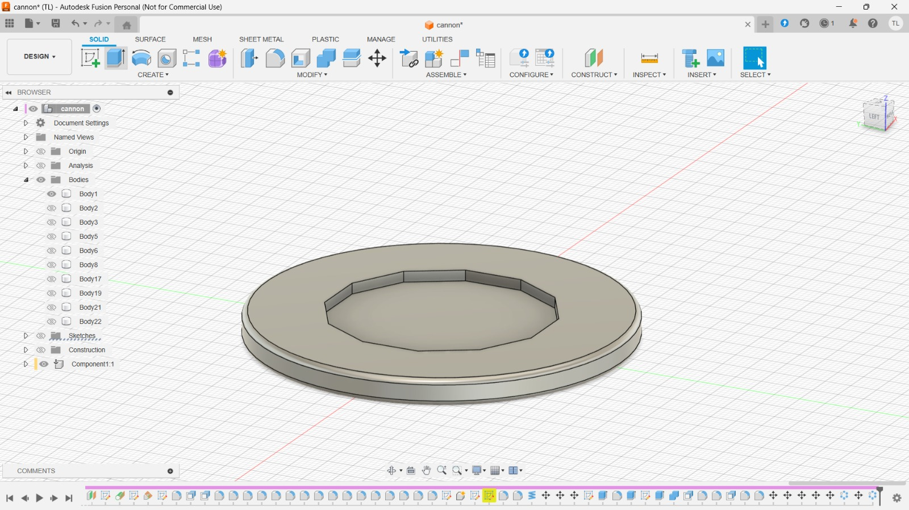
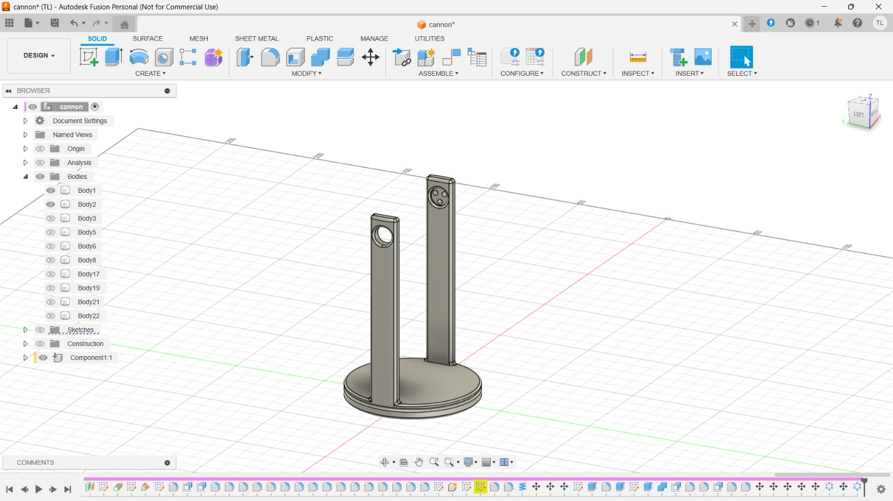
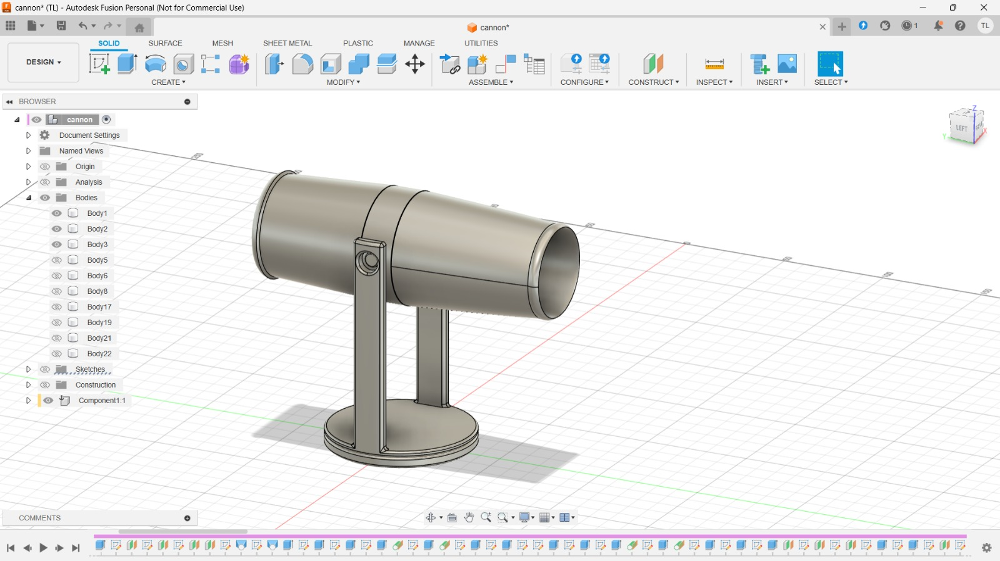
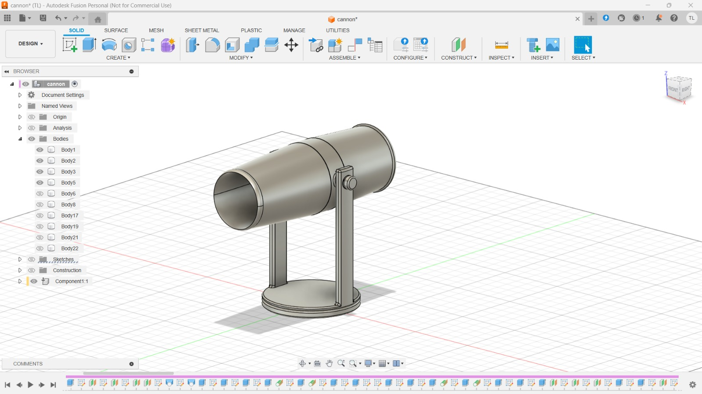
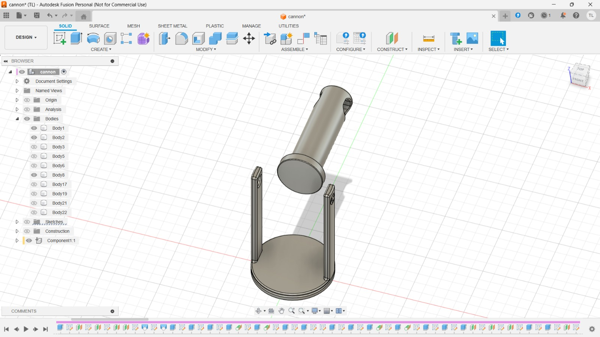
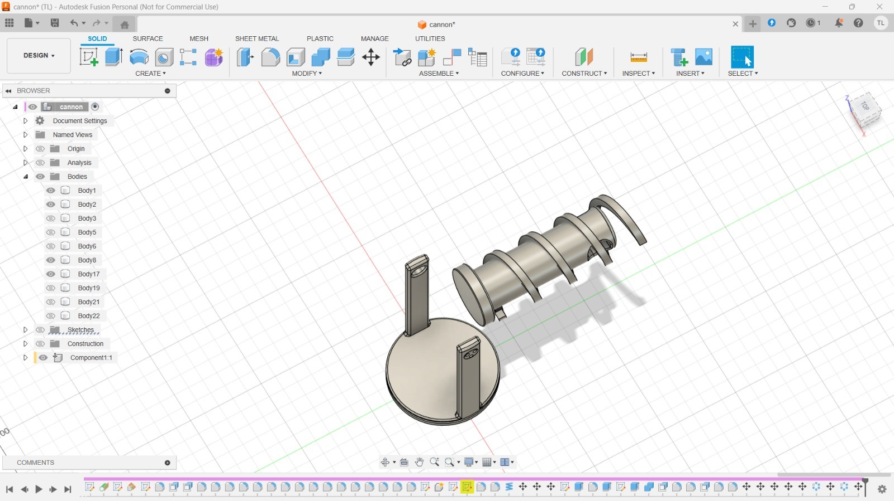
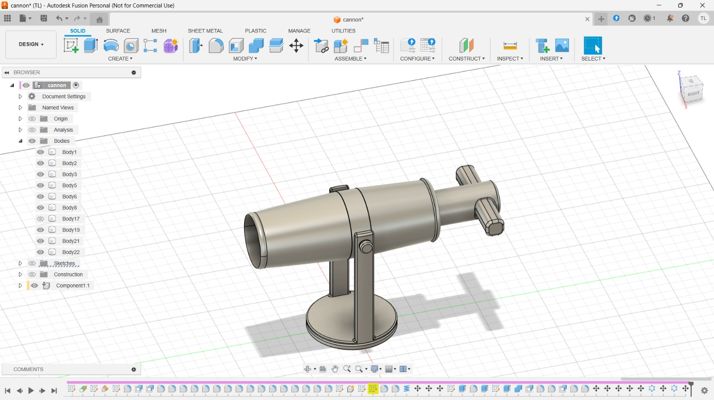

And then combined with the base frame:
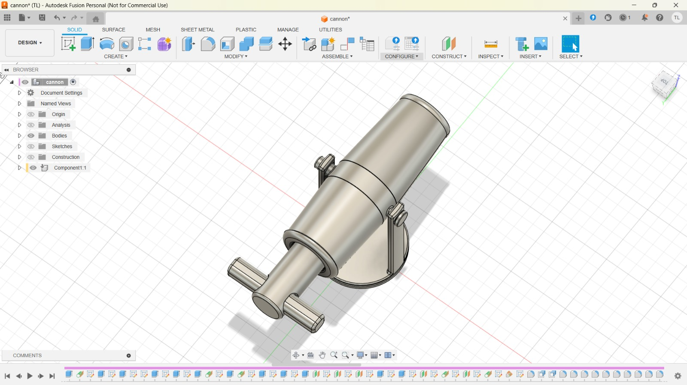
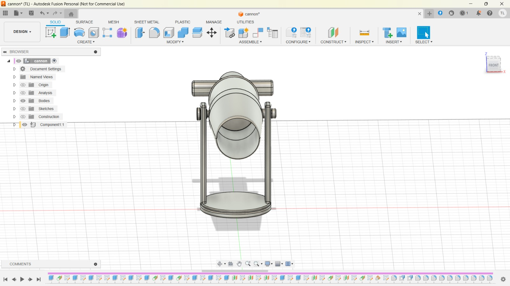

**Tip:**  
Beginners and younger makers can focus on the creative aspect, using a provided ballista base and arms to ensure a working launcher. Advanced users can challenge themselves by engineering every part from scratch.

### 2. Prepare for 3D Printing

**Objective**: Export and slice your ballista model for printing.

**Contents:**

1. Export the finished ballista parts in STL format.
2. Import the STL files into your slicer software (e.g., Bambu Studio).
3. Adjust orientation for best print strength and quality.
4. Configure print settings:
   - Layer height: 0.16-0.2mm for strength
   - Infill: 20% or higher for durability
   - Supports: Enable for overhangs and moving parts
5. Slice and preview the print.

Slicer preview:
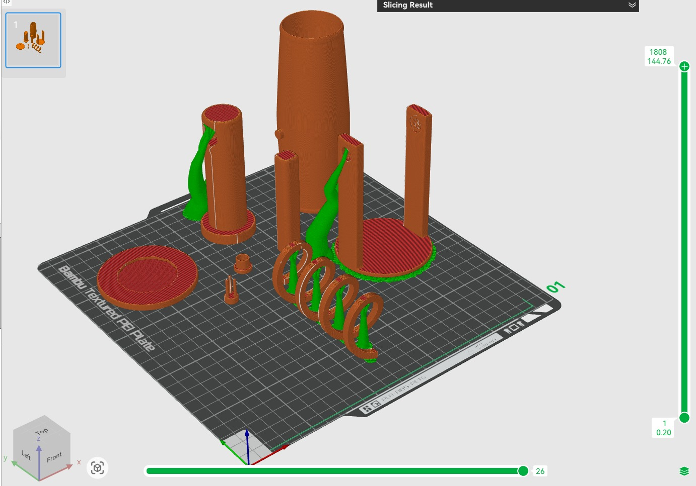

### 3. Finish and Test Your Ballista

**Objective**: Post-process and assemble your ping pong ballista.

**Content**:

**Post-Processing**  
   - Remove the print and clean up any supports or rough edges.
   - Sand the surfaces for smooth movement, especially at pivot points and the ball channel.
   - (Optional) Paint your ballista:
     - Use acrylic paint for team colors or battle effects.
     - Add gloss or matte varnish for different finishes.

Finished ballista:
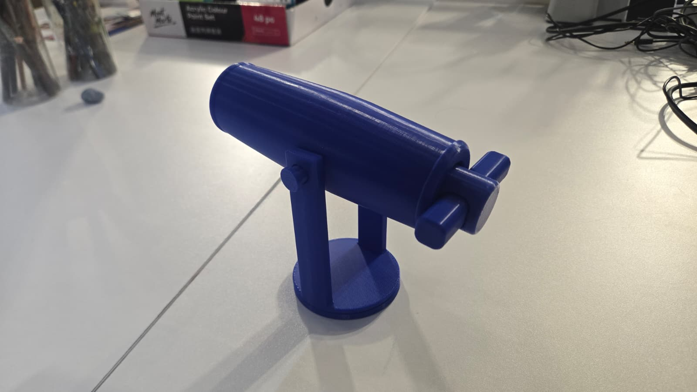
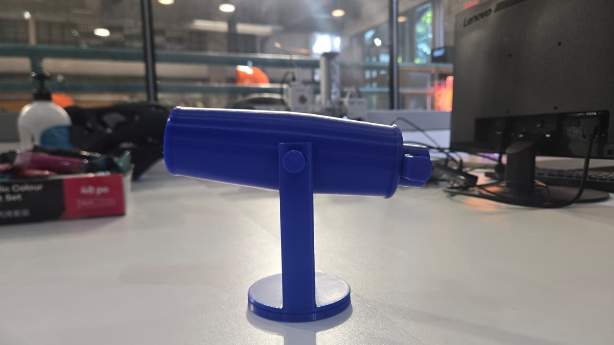
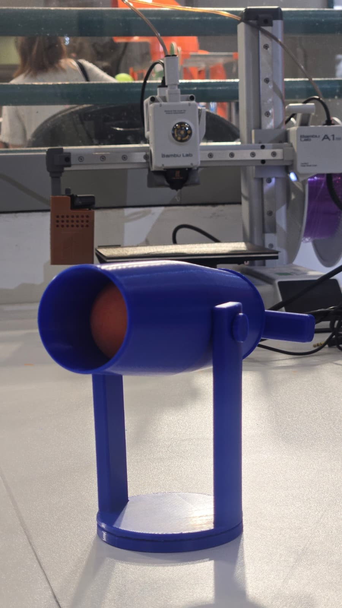

4. Assemble the ballista, load a ping pong ball, and test fire! Make adjustments for best range and accuracy.

5. Play the Ballista Challenge Game

### Materials Needed
- 3D-printed ballista (or similar ping pong ball launcher)
- Ping pong balls (ammunition)
- Targets (e.g., stacked cups, cardboard towers, or moving objects on strings)
- Measuring tape and protractor (for angle and distance calculations)
- Scoreboard and timer

### Game Rules & Setup

#### 1. Target Knockdown (Static Mode)
- Set up a tower of cups or lightweight blocks as the target.
- Students adjust the ballista’s angle and power to knock down the target in as few shots as possible.

**Scoring:**
- 3 points for a direct hit (target falls completely)
- 1 point for a glancing blow (target is moved but not knocked down)

#### 2. Moving Target Challenge
- Hang a lightweight object (e.g., a paper plate) from a string and set it swinging like a pendulum.
- Students must time their shot to hit the moving target.

**Scoring:**
- 5 points for a direct hit (target stops or is knocked off)
- 2 points for touching the target

#### 3. Distance & Accuracy Trial
- Place a bucket or hoop at different distances from the launcher.
- Students calculate and set the correct angle and force to land the ball inside the target.

**Scoring:**
- 10 points for landing in the farthest target
- 5 points for mid-range
- 2 points for the closest

---

Encourage students to record their scores, adjust their designs or aim, and compete for the highest total!

---

**Tip:**  
- Intermediate students can try with a given technical drawing.
- Advanced students are encouraged to start from scratch, measuring and modeling the ballista for a complete engineering and design experience.

---

## Optional Projects

### Multi-Color Printing
- Use multi-color filament to print the frame, arms, and decorations in different colors.

### Themed Ballista Shields
- Design and print custom shields or banners for your ballista (e.g., medieval, sci-fi, fantasy).

### Ballista Target Range
- Design and print a set of targets or obstacles for competitive ballista battles.

---

