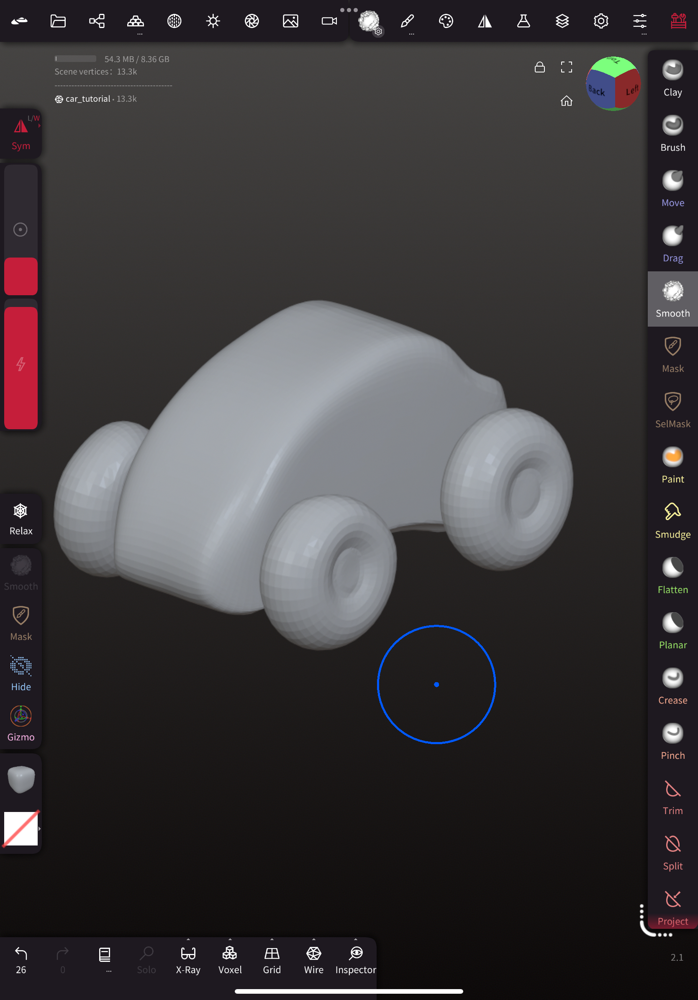
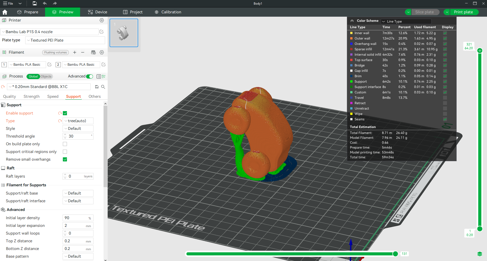

# Vehicle Design and Aerodynamics Project

---

## Abstract

This course explores the exciting intersection of technology, design, and aerodynamics, offering students a hands-on learning experience that spans 3D scanning, model modification, 3D printing, and wind tunnel testing. Through structured lessons, students will engage in the research and development process of vehicle design, from conceptualization to testing and iteration.

Younger students will focus on aesthetics, while older students delve deeper into aerodynamics principles, fostering age-appropriate learning. The program emphasizes critical skills such as design thinking, problem-solving, and iterative development, empowering students to refine their prototypes based on performance data.

By the end of the course, students will present their design process, analyze wind tunnel results, and race their vehicles in a friendly competition. The course aims to inspire creativity and spark interest in engineering through real-world applications, culminating in a deeper understanding of modern vehicle design and aerodynamics principles.

---

## What You Will Learn

Students will:

- Gain hands-on experience with 3D scanning and model creation using AI tools and 3D scanners.

- Develop proficiency in 3D model modification using software like Nomad, tailored for aesthetic and aerodynamic improvements.

- Understand key concepts of aerodynamics and design optimization.

- Learn the fundamentals of 3D printing, including slicing techniques, support structures, and print orientation.

- Apply iterative design processes to refine prototypes based on wind tunnel testing results.

- Analyze airflow patterns and aerodynamic performance in vehicle designs.

- Build teamwork and presentation skills through collaborative activities and final showcases.

## What You Will Need

| Category | Equipment | Description | Required/Optional |
|----------|-----------|-------------|------------------|
| **3D Scanning and Modeling** | 3D Scanner | For scanning real-life car models | Optional |
| | PC or Laptop | For running 3D modeling and scanning software (ensure it has sufficient processing power for smooth operation) | Required |
| | Graphics Tablet | For precise modifications in 3D modeling software like Nomad | Required |
| **3D Printing** | 3D Printer | Preferably a desktop FDM (Fused Deposition Modeling) printer (e.g. Bambu Lab Printer) | Required |
| | 3D Printing Filament | PLA or PETG filament for prototyping | Required |
| | Slicing Software | Free or paid slicing programs (e.g. Bambu Studio) | Required |
| **Wind Tunnel Testing** | Wind Tunnel | A small-scale wind tunnel for educational use. Consider models designed for classroom purposes or build a DIY wind tunnel | Required |
| | Smoke Generator or Fog Machine | For airflow visualization during testing | Required |
| | Anemometer | For measuring airflow velocity in the wind tunnel | Optional |
| **Post-processing Tools** | Sandpaper | For post-print finishing | Optional |
| | Acrylic and Painting Tools | Decorate the printed car | Optional |
| **Miscellaneous** | Power Supply | Ensure an appropriate power source for all devices | Required |
| | Safety Equipment | Gloves, safety glasses, and a well-ventilated workspace for using 3D printing and wind tunnel equipment | Required |
| | Workstation and Storage | A sturdy table and storage boxes for keeping hardware and prototypes organized | Required |

## Course Outline

### Chapter 1: 3D Model Generation

**Objective**: Teach students to create a 3D model using various methods.

**Content**:
- Use AI-based tools to generate 3D models
- Learn how to use a 3D scanner to scan real-life car models
- Clean up scanned models using Nomad, addressing noise and remeshing for better modification
  - Optional: Quad Remesher addon in Nomad Scult for enhanced remeshing

### Chapter 2: 3D Model Modification

**Objective**: Customize and improve 3D models based on age-appropriate focus areas.

**Content**:
- Younger students(12-15 years old):
  - Modify models with a focus on aesthetic appeal using Nomad
  - Techniques include Drag and Move tools
- Older students(16-18 years old):
  - Explore basic aerodynamics
  - Refine the car body shape for better airflow

### Chapter 3: Preparing for 3D Printing

**Objective**: Prepare the 3D model for successful 3D printing.

**Content**:
- Export the 3D model to a slicing software
- Learn design considerations:
  - Print orientation
  - Support structures
  - Overhangs
- Adjust designs and print prototypes

### Chapter 4: Testing in a Wind Tunnel

**Objective**: Analyze the aerodynamic performance of the designs.

**Content**:
- Test car models in a wind tunnel
- Observe airflow patterns and identify areas for improvement in both aesthetics and aerodynamics
- Iterate the design process:
  - Modify and print a new prototype

## Project Steps

### Chapter 1: Generating the 3D Model

**Objective**: Create an initial 3D car model using AI tools.

**Content**:
1. Source a reference car image
2. Use Tripo AI to generate a 3D model:
   - Upload your reference image
   - Adjust generation parameters as needed
   - Download the generated 3D model

{width=500 height=500}

### Chapter 2: Model Modification

**Objective**: Customize the car model's appearance.

**Content**:
1. Import the generated model into Nomad Sculpt
2. Use basic modification tools:
   - Drag tool for reshaping surfaces
   - Move tool for adjusting specific areas
   - Smooth tool for evening out rough spots

### Chapter 3: Preparing for 3D Printing

**Objective**: Convert the 3D model for printing.

**Content**:
1. Export model from Nomad in STL format
2. Import into slicer software:
   - Adjust model orientation for optimal printing
   - Add support structures where needed
   - Configure print settings (layer height, infill, etc.)
3. Generate G-code and print

### Chapter 4: Wind Tunnel Testing

**Objective**: Test and improve aerodynamics.

**Content**:
1. Place printed model in wind tunnel
2. Observe airflow patterns:
   - Look for turbulence areas
   - Identify high-resistance zones
3. Document findings
4. Make design improvements:
   - Modify problem areas in Nomad
   - Print revised version
   - Test again to verify improvements

> Note: Images shown are placeholders. Replace with actual project photos.

