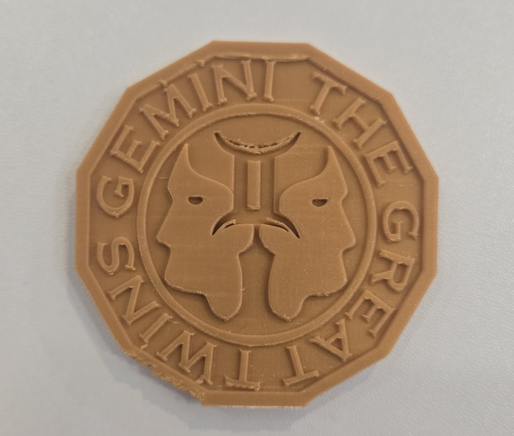

# Zodics Coin Design Project

---

## Abstract

This hands-on project guides you through the process of designing and creating your own custom Zodics Coin using AI tools, digital sculpting, and 3D printing. You'll learn how to generate unique coin designs based on zodiac signs, refine them in Nomad Sculpt, and produce a physical coin using a 3D printer. This project blends creativity, digital modeling, and practical prototyping.

---

## What You Will Learn

- How to use AI tools to generate 2D and 3D coin designs based on zodiac themes
- Techniques for importing, cleaning, and refining models in Nomad Sculpt
- Customizing coin features such as relief, text, and edge patterns
- Preparing and slicing models for 3D printing
- Basics of 3D printing and post-processing
- Presenting and photographing your finished coin

## What You Will Need

| Category         | Item                                   | Notes                                 | Required/Optional |
|------------------|----------------------------------------|---------------------------------------|------------------|
| Hardware         | Smartphone/Tablet                      | Stylus support recommended            | Required         |
|                  | Laptop/Desktop                         | For slicing and 3D printing           | Required         |
|                  | FDM 3D Printer                        | e.g. BambuLab                         | Required         |
|                  | Resin 3D Printer                      | For higher detail, e.g. Phrozen       | Optional         |
| Software         | AI Image Generation                    | ChatGPT, DALL-E, Midjourney           | Required         |
|                  | Nomad Sculpt                          | iOS/Android – paid                    | Required         |
|                  | Slicing Software                      | Chitubox, Bambu Studio                | Required         |
| Tools & Materials| 3D Printer Filament/Resin              | PLA, PETG, or resin                   | Required         |
|                  | Finishing Tools                       | Sandpaper, files, rotary tool         | Optional         |
|                  | Painting Tools                        | Brushes, acrylics, metallic paints    | Optional         |

---

## Course Outline

### Chapter 1: Introduction to AI-Driven Coin Design
- Overview of AI image generation tools
- Exploring zodiac symbolism and coin design prompts
- Generate a coin face image using ChatGPT or DALL-E
- Use the image to generate a 3D relief model

### Chapter 2: Sculpting and Refinement in Nomad Sculpt
- Importing AI-generated models into Nomad Sculpt
- Cleaning geometry and optimizing mesh for coins
- Adding relief, text, and edge details
- Adjusting coin thickness and diameter

### Chapter 3: Preparing for 3D Printing
- Exporting STL files from Nomad Sculpt
- Importing into slicer software
- Configuring print settings for coins (layer height, infill, supports)
- Previewing and slicing the model

### Chapter 4: Post-Processing and Finishing
- Removing supports and cleaning the print
- Sanding and smoothing surfaces
- Painting and finishing techniques for metallic effects
- Photographing and presenting your finished coin

---

## Project Steps

### 1. Generating the Coin Design

**Objective**: Create an initial coin face design using AI tools.

**Content**:
1. Research zodiac symbols and decide on your theme (e.g., your own zodiac sign).
2. Use ChatGPT or DALL-E to generate a high-contrast image suitable for a coin face.
   - Example prompt: "Create a circular coin design featuring the Leo zodiac symbol in a classical engraved style."
3. Download the generated image.

Example AI-generated coin face:

### 2. Creating the 3D Coin Model

**Objective**: Transform your 2D design into a 3D coin model.

**Content**:
1. Import the AI-generated image into Nomad Sculpt as a reference.
2. Use sculpting tools to create a raised relief based on the image.
3. Add details such as:
   - Raised or engraved zodiac symbol
   - Decorative border or edge pattern
   - Text (e.g., zodiac name, year)
4. Adjust the coin's thickness and diameter (e.g., 30-40mm diameter, 2-3mm thick).

Coin model in Nomad Sculpt:

### 3. Preparing for 3D Printing

**Objective**: Export and slice your coin model for printing.

**Content**:
1. Export the finished coin model from Nomad Sculpt in STL format.
2. Import the STL into your slicer software (e.g., Bambu Studio).
3. Adjust orientation for best print quality (face up recommended).
4. Configure print settings:
   - Layer height: 0.1-0.2mm for detail
   - Infill: 100% for solid feel
   - Supports: May not be needed if printing face up
5. Slice and preview the print.

Slicer preview:

### 4. Printing and Post-Processing

**Objective**: Print and finish your Zodics Coin.

**Content**:
1. Print the coin using your 3D printer.
2. Remove the print and clean up any rough edges or supports.
3. Sand the surfaces for a smooth finish.
4. (Optional) Paint the coin with metallic paints for a realistic look.

Printed coin before finishing:

Painted and finished coin:

---

## Optional Projects

### Multi-Material Coins
- Experiment with dual-color or multi-material printing for contrast between the symbol and background.

### Coin Display Stand
- Design and print a small stand to display your finished coin.

### Custom Zodiac Series
- Create a full set of coins, one for each zodiac sign, and present them as a collection.

---

> Note: Images shown are placeholders. Replace with your own project photos as you complete each step.
