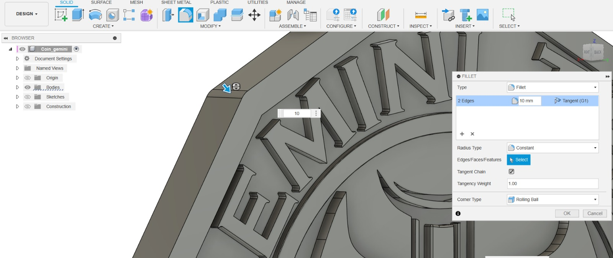
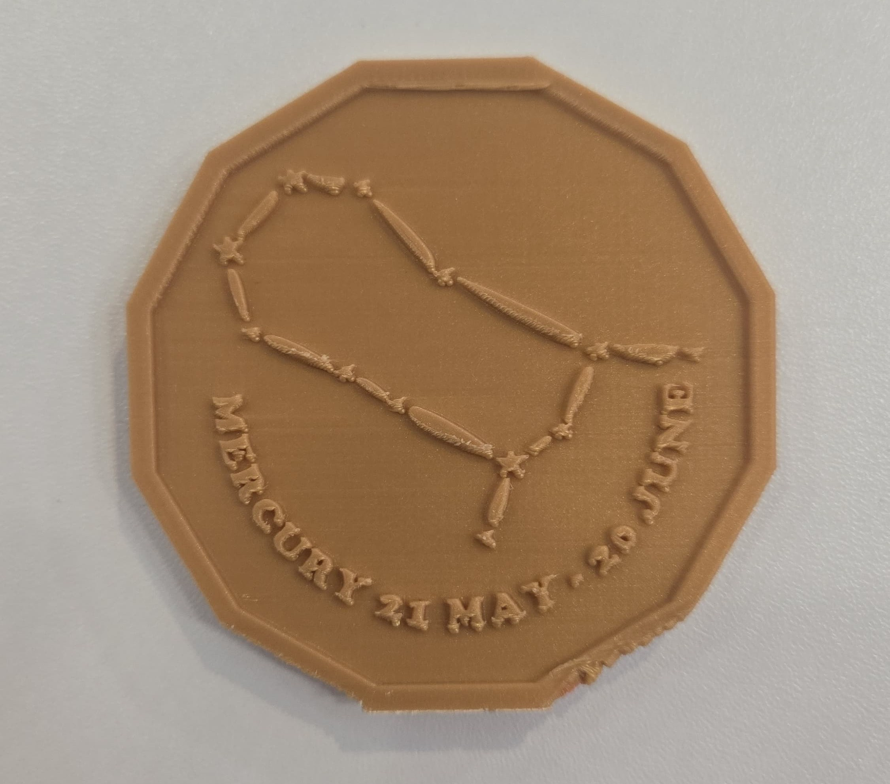

# Zodiac Coin Design Project

---

## Abstract

This hands-on project guides you through the process of designing and creating your own custom Zodiac Coin using tools, digital sculpting, and 3D printing. You'll learn how to generate unique coin designs based on zodiac signs, refine them in Nomad Sculpt, and produce a physical coin using a 3D printer. This project blends creativity, digital modeling, and practical prototyping.

---

## What You Will Learn

- How to use tools to generate 3D coin designs based on zodiac themes
- Techniques for importing, cleaning, and refining models in Fusion 360
- Customizing coin features such as relief, text, and edge patterns
- Preparing and slicing models for 3D printing
- Basics of 3D printing and post-processing
- Presenting and photographing your finished coin

## What You Will Need

| Category         | Item                                   | Notes                                 | Required/Optional|
|------------------|----------------------------------------|---------------------------------------|------------------|
| Hardware         | Laptop/Desktop/iPad                    | For modelling, slicing and 3D printing| Required         |
|                  | FDM 3D Printer                         | e.g. BambuLab                         | Required         |
|                  | Resin 3D Printer                       | For higher detail, e.g. Phrozen       | Optional         |
| Software         | AI Image Generation                    | ChatGPT, DALL-E, Midjourney           | Optional         |
|                  | Nomad Sculpt                           | Smoothen, Detailed Design             | Required         |
|                  | Fusion 360                             | For 3D designing                      | Required         |
|                  | Slicing Software                       | Chitubox, Bambu Studio                | Required         |
| Tools & Materials| 3D Printer Filament/Resin              | PLA, PETG, or resin                   | Required         |
|                  | Finishing Tools                        | Sandpaper, files, rotary tool         | Optional         |
|                  | Painting Tools                         | Brushes, acrylics, metallic paints    | Optional         |

---

## Course Outline

### Chapter 1: Designing and Refinement in Fusion 360
- Creating geometry and optimizing mesh for coins
- Adding relief, text, and edge details
- Adjusting coin thickness and diameter

### Chapter 2: Preparing for 3D Printing
- Exporting STL files from Fusion 360
- Importing into slicer software
- Configuring print settings for coins (layer height, infill, supports)
- Previewing and slicing the model

### Chapter 3: Post-Processing and Finishing
- Removing supports and cleaning the print
- Sanding and smoothing surfaces
- Painting and finishing techniques for metallic effects
- Photographing and presenting your finished coin

---

## Project Steps

### 1. Creating the 3D Coin Model

**Objective**: Building a 3D coin model.

**Content**:
1. Use Fusion tools to create a raised relief based on the image.
2. Create a 12-sided polygon base:
   - Use the "Polygon" tool in Fusion 360
   
   - Set the number of sides to 12
   - Draw the polygon with appropriate diameter (e.g., 30-40mm)
   
   - Extrude the polygon to create a coin thickness (2-3mm)
   

3. Create the coin relief:
   - Import or create your zodiac symbol design(e.g. svg file)
   
   - Use the "Extrude" tool to create raised relief on the front face
   - Adjust the extrude depth (typically 0.5-3mm for good visibility)
   
   
   - Use "Fillet" tool to round the edges for a more realistic coin appearance
   
   

4. Add text and details:
   - Use the "Text" tool to add zodiac name and months
   - Position text elements on the coin face
   
   
   
   - Use "Extrude" to create raised text or "Cut" for engraved text
   - Add decorative border patterns using sketch tools and extrude/cut operations

5. Create the reverse side:
   - Mirror or create a new design for the back of the coin
   
   - Add complementary details, symbols, or text
   - Ensure both sides are properly aligned

6. Finalize the design:
   - Add a small hole in the center if desired (for hanging/display)
   - Apply fillets to all sharp edges for safety and aesthetics
   - Check that the model is manifold and ready for 3D printing

Coin model in Fusion 360:

### 2. Nomad Sculpt for Detailed Design
**Objective**: Add intricate details and custom textures to your coin model using Nomad Sculpt.

**Content**:
1. Export your basic coin shape from Fusion 360 as an STL file, then import it into Nomad Sculpt. 
2. Use Nomad Sculpt’s sculpting brushes to add or refine reliefs, engrave patterns, or create additional symbols on the coin’s surface. 
   -  Push, pull, carve, or smooth areas to achieve the desired level of detail.
3. Apply surface textures, or material effects directly in Nomad Sculpt to visualize how your finished coin might look.
4. Once satisfied with your sculpted and textured coin, export the model as an STL file. 

**Nomad Sculpt allows for a higher level of artistic customization than traditional CAD tools. This workflow is ideal if you want to create coins with unique, hand-crafted details or artistic flourishes that go beyond basic modeling.**

Coin model in Nomad:

### 3. Preparing for 3D Printing

**Objective**: Export and slice your coin model for printing.

**Content**:
1. Export the finished coin model from Fusion 360 in STL format.
2. Import the STL into your slicer (e.g., Bambu Studio).
3. Adjust orientation for best print quality (face up recommended).
4. Configure print settings:
   - Layer height: 0.1-0.2mm for detail
   - Infill: 10% for solid feel
   - Supports: May not be needed if printing face side
5. Slice and preview the print.

Slicer preview:

### 3. Printing and Post-Processing

**Objective**: Print and finish your Zodiac Coin.

**Content**:
1. Print the coin using your 3D printer.
2. Remove the print and clean up any rough edges or supports.
3. Sand the surfaces for a smooth finish.
4. (Optional) Paint the coin with metallic paints for a realistic look.

Finished coin:

---

## Optional Projects

### Metal Painting Techniques
- Enhance your 3D printed coin by applying metal painting techniques for a realistic metallic finish.
- After sanding and cleaning the coin, apply a primer suitable for plastic surfaces.
- Use metallic acrylic paints (such as gold, silver, bronze, or copper) to paint the coin's surface.
- For added depth, use a dark wash or patina effect in recessed areas, then highlight raised details with a lighter metallic shade.
- Finish with a clear gloss or matte varnish to protect the paint and give the coin a professional look.

### Coin Display Stand
- Design and print a small stand to display your finished coin.

### Custom Zodiac Series
- Create a full set of coins, one for each zodiac sign, and present them as a collection.

---
