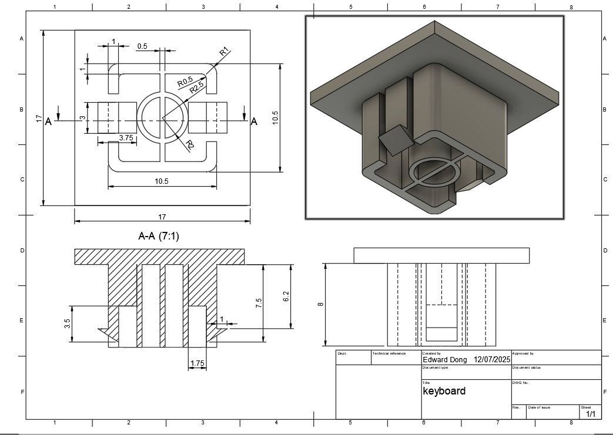

# Keyboard Cap Design Project
## Abstract

This hands-on project guides you through the process of designing and creating your own customised keyboard cap using digital sculpting and 3D printing. You'll learn how to produce a keycap for your mechanical keyboard, and then add your own design on top of the keycap. This project blends creativity, digital modeling, and practical prototyping.

---

## What You Will Learn

- How to design your very own customised keyboard cap for MX-style mechanical keyboards
- Techniques for digital sculpting and modeling in Nomad Sculpt and/or Fusion 360
- Preparing and slicing models for 3D printing
- Basics of 3D printing and post-processing

## What You Will Need

| Category         | Item                                   | Notes                                 | Required/Optional |
|------------------|----------------------------------------|---------------------------------------|------------------|
| Hardware         | Laptop/Desktop/iPad                    | For digital sculpting, modelling and slicing     | Required         |
|                  | FDM 3D Printer                        | e.g. BambuLab                         | Required         |
|                  | Resin 3D Printer                      | For higher detail, e.g. Phrozen       | Optional         |
| Software         | Nomad Sculpt or Fusion 360             | For 3D modeling                       | Required         |
|                  | Slicing Software                      | Chitubox, Bambu Studio                | Required         |
| Tools & Materials| 3D Printer Filament/Resin              | PLA, PETG, or resin                   | Required         |
|                  | Finishing Tools                       | Sandpaper, files, rotary tool         | Optional         |
|                  | Painting Tools                        | Brushes, acrylics, pastel paints      | Optional         |
|                  | Keycap Stem Reference                 | For MX-style switches                 | Required         |

---

## Course Outline

### Chapter 1: Designing and Refinement in Nomad Sculpt or Fusion 360
- Overview of keyboard cap anatomy and MX stem compatibility
- (For advanced students) Measure and recreate an exisitng keycap and ensure it fits the provided keyboard
- (For intermediate studetns) Model and recreate the keycap using the given mechanical drawing
- Add your own design onto keycap using Fusion 360 or Nomad

### Chapter 2: Preparing for 3D Printing
- Exporting STL files from your modeling software
- Importing into slicer
- Configuring print settings for small, detailed parts
- Previewing and slicing the model
- 3D print

### Chapter 3: Post-Processing and Finishing
- Removing supports and cleaning the print
- Sanding and smoothing surfaces
- Painting and finishing 
- Assembling and testing the keycap on your keyboard

---
## Project Steps - Adapting the Project to Skill Level
This project can be tailored to different experience levels, from beginners to advanced makers. Here’s how you can approach each step: 

### 1. Creating a customised keycap

**Objective**: Build a 3D model of the key cap

- **Contents:**

- **Advanced:**  
  - Start by carefully measuring an existing MX-style keycap using calipers or a ruler.
  - Record key measurements such as width, height, stem size, and overall profile. 
  - Optionally, refer to a mechanical drawing or datasheet for precise specifications.
  - In Fusion 360, create the keycap base using your measured dimensions or the provided mechanical drawing.
  - Model the MX-style stem to ensure compatibility with your keyboard switches.
  - Design a customised keycap in Fusion 360 or Nomad Sculpt and combine it with the existing keycap base.
  - Export your finished model as an STL file, slice and print it, then post-process (remove supports, sand, and paint) for a realistic finish.

- **Intermediate:**  
  - Use the provided mechanical drawing or reference model for the keycap stem and base dimensions.
  - Model the keycap base in Fusion 360, ensuring the stem fits MX-style switches.
  - Design a customised keycap in Fusion 360 or Nomad Sculpt and combine it with the existing keycap base.
  - Export, slice, print, and finish your keycap as above.

  Mechanical drawing of the keycap stem:

- **Beginner/Younger Groups:**  
  - Skip the measuring and base modelling steps. Use the pre-made keycap stem model instead.
  - Focus on the creative aspects: in Nomad Sculpt or Fusion 360, create your own design, and attach it to the provided base.
  - Export, slice, print, and paint your keycap.

Here's an example of customised Donut Keycap built in Fusion:

And then combined with the base keycap model:

**Tip:**  
Beginners and younger makers can focus on the creative aspect, using a provided keycap base and stem to ensure a good fit. Advanced users can challenge themselves by modeling every part from scratch.

### 2. Prepare for 3D Printing

**Objective**: Export and slice the keycap model for printing.

**Contents:**

1. Export the finished keycap model in STL format.
2. Import the STL into your slicer software (e.g., Bambu Studio).
3. Adjust orientation for best print quality.
4. Configure print settings:
   - Layer height: 0.08-0.1mm for detail
   - Infill: 10% or high
   - Supports: Enable for tree support
4. Slice and preview the print.

Slicer preview:

### 3. Finish Your Customised Keycap

**Objective**: Post-process the customised keycap.

**Content**:

**Post-Processing**  
   - Remove the print and clean up any supports or rough edges.
   - Sand the surfaces for a smooth finish, especially the stem area.
   - (Optional) Paint the your model:
     - Use acrylic paint to make the model more colourful.
     - Add gloss or matte varnish for different effects.

Finished donut keycap:

4. Test fit the keycap on your keyboard. Make adjustments if needed.

---

**Tip:**  
- Beginners and younger makers can focus on steps 3 and 4, using a provided keycap base.
- Intermediate students can try with a given drawing.
- Advanced students are encouraged to start from scratch, measuring and modeling the keycap base themselves for a complete engineering and design experience.

---

## Optional Projects

### Multi-Color Printing
- Use multi-color filament to print the frosting and base in different colors.

### Other Food-Themed Keycaps
- Design and print a series of food-themed keycaps (e.g., burger, pizza, sushi) for a fun keyboard set.

### Keycap Display Stand
- Design and print a small stand to display your donut keycap when not in use.

---

