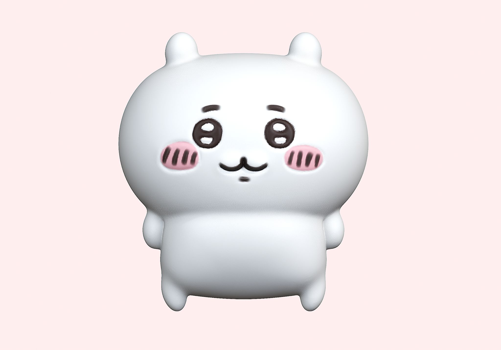
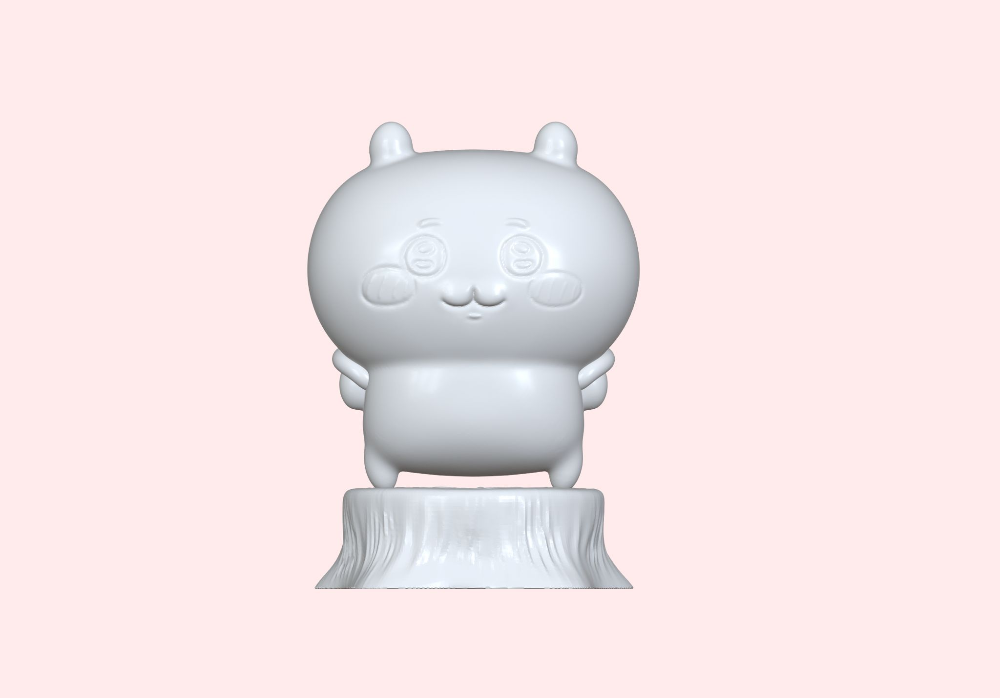
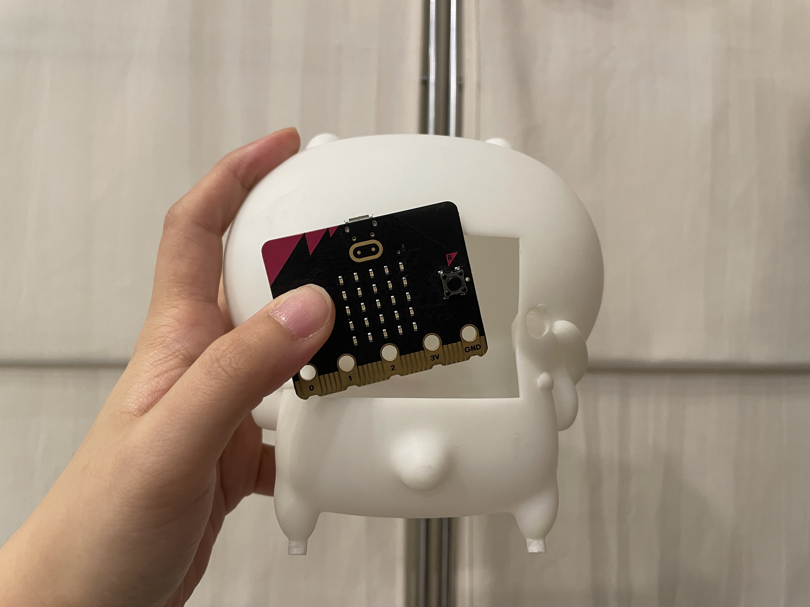
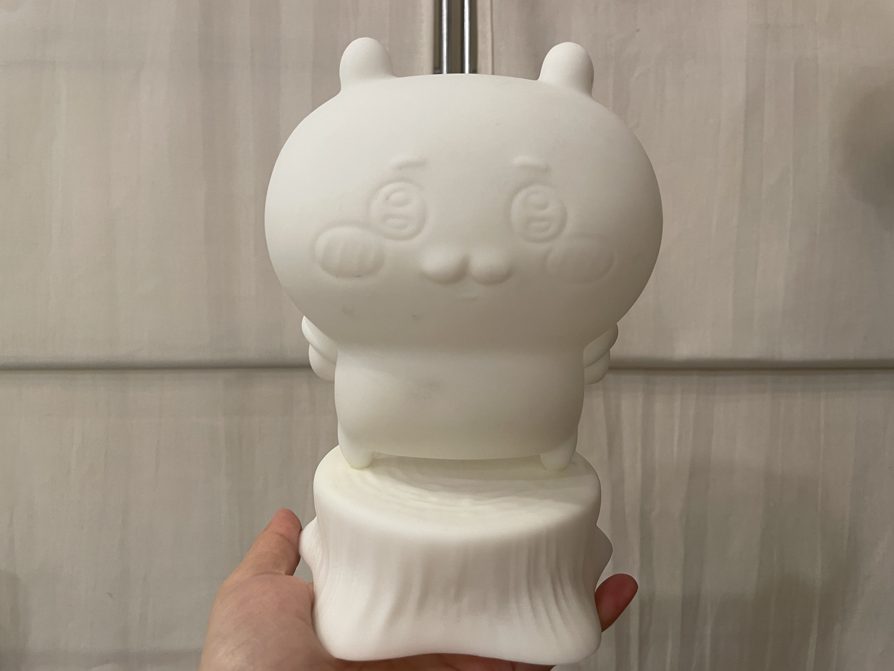
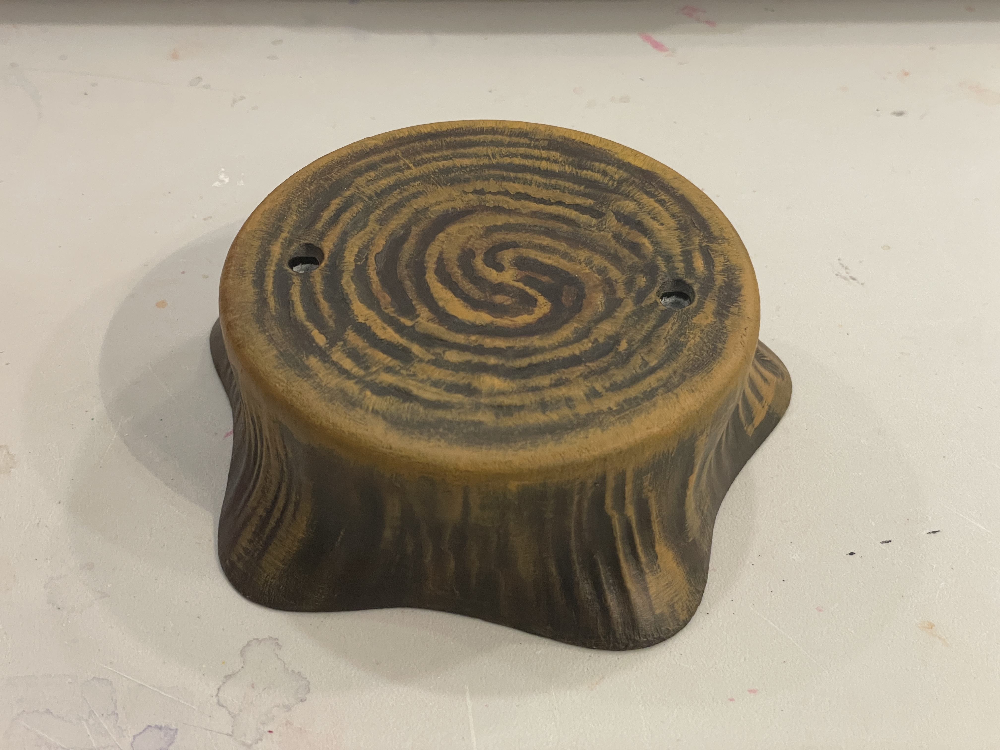
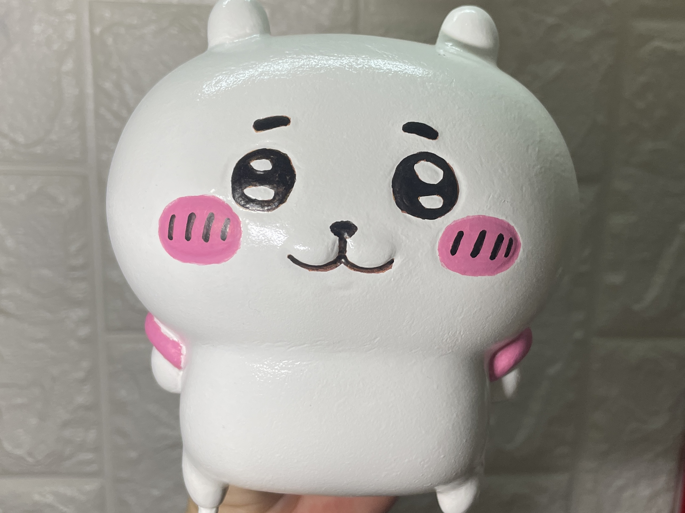
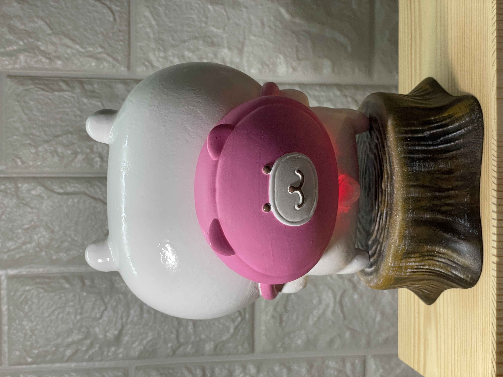
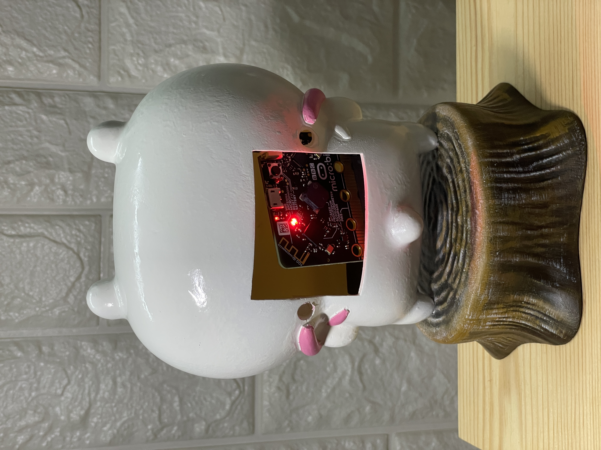

# 原創角色工作坊：AI × 3D建模  

---
## 這是什麼？

「Chiikawa 專案」是一個結合數位雕刻與角色製作的實作型學習活動。學生將使用專業 3D 建模應用程式 Nomad Sculpt，從基礎形狀出發，​透過簡單易懂的步驟，即使是初學者也能輕鬆掌握數位雕刻技巧，並一步步製作出人氣角色「Chiikawa」的 3D 模型，最終完成導出 3D 檔案、完成 3D 打印及上色的流程。

本專案不僅讓學生探索 3D 建模與角色設計的核心概念，更透過實際操作深入理解數位建模工具與 3D 建模技巧，從而建立起空間感與數位創作的信心與能力。

### 主要特點

- 以人氣角色為主題，提高學生參與及投入感

- 結合數位建模、創意設計與實體輸出，完整呈現創作流程

- 步驟清晰、操作直觀，適合初學者上手

- 鼓勵原創模型造型與擴充應用，發展創造力與跨域思維

這個專案是一個趣味與技術並重的完整創作體驗，讓學生透過實作建立 3D 建模的基礎能力，也為未來更多創新應用打下良好基礎。

## 你將學到什麼？

參與 Chiikawa 3D 建模專案，學生將從零開始學習如何將一個 2D 角色的設計概念，轉化為完整的實體 3D 模型，並透過動手操作掌握以下技能與知識：

**數位建模與雕刻技能**

- 使用 Nomad Sculpt 操作基本工具（如 Gizmo、Move、Smooth）進行造型調整與細節雕刻

- 掌握 對稱建模、分件組裝 與 造型變形 的基本技巧

- 理解 3D 模型的結構與比例分配，培養空間想像與觀察力

**角色設計與視覺表達**

- 學習從參考圖開始進行角色造型設計與結構建構

- 練習面部表情與身體特徵的立體雕刻，提升造型表達與個人風格呈現

**數位轉實體流程**

- 掌握從數位模型到 3D 打印檔案（.stl/.obj）的轉換流程

- 學會合併分件（Boolean）、匯出檔案與打印前的檢查技巧

- 體驗打印完成後的後製處理，包括上色與組裝

**跨域整合與創意應用**

- 可選擇結合 Micro:bit 控制元件，了解模型與互動科技的初步整合概念

- 鼓勵創意延伸與自定義角色造型，啟發創新思維與美學設計能力

這項專案讓你不只是學會操作 3D 建模工具，更重要的是建立從創意發想到實體製作的完整創作流程，為未來進一步探索動畫、遊戲設計、產品原型開發等領域打下堅實的基礎。

## 你需要的東西

### 硬件（Hardware）

| 項目                                          | 描述                                                                 | 數量 | 必需/可選 |
|----------------------------------------------|----------------------------------------------------------------------|----------|----------|
| iPad 或 Android 平板裝置                      | 已安裝 Nomad Sculpt 應用程式，建議配備手寫筆以提升操作精度               |1         | Y        |
| 電腦                                          | 用於整理與上傳檔案至 3D 打印機，建議配備滑鼠使用                          | 1        | Y        |
| 3D 打印機                                     | 打印出完成的 .stl/.obj 檔案                           | 1        | Y        |
| （選用）BBC micro:bit V2                        | 用於擴展互動功能                                               | 1        | N        |
| （選用）用於編程的 USB 線                        | 用於編程 micro:bit 的電纜（本項目使用 V2）    | 1        |N        |
| （選用）電池盒                                    | 用於啟動編程 micro:bit 主板，確保開啟運作 | 1        | N        |
| （選用）電池                                    | 用於啟動編程 micro:bit 主板，確保開啟運作 | 2        | N        |

### 軟件（Software）

| 項目                                         | 描述                                                                 | 數量 | 必需/可選 |
|----------------------------------------------|----------------------------------------------------------------------|----------|----------|
| Nomad Sculpt                     | 3D建模應用程式（iOS / Android 皆可使用）               |1         | Y        |
| 切片軟件（Slicer）                                        | 用於進行 3D 打印設定，轉換 .stl/.obj 檔案至 3D 打印機可讀取的格式                          | 1        | Y        |
| （選用）Micro:bit 編程工具                                     | 用於撰寫互動程式碼                              | 1        | N        |

### 工具（Tools & Materials）

| 項目                                         | 描述                                                                 | 數量 | 必需/可選 |
|----------------------------------------------|----------------------------------------------------------------------|----------|----------|
| 手寫筆                                        | 提升 3D建模操作精度               |1         | Y        |
| 模型打磨工具                                      | 砂紙                         | 1        | Y        |
| 模型組裝輔助工具                                 | 膠水                              | 1        | Y        |
| 模型上色工具                                      | 壓克力顏料、調色盤、畫筆                         | 1        | Y        |

## 如何運作

建模流程分為以下步驟：​

1. **準備與設定** ：啟動 Nomad Sculpt，建立新專案並匯入 Chiikawa 的參考圖片，以球體為頭部的起點進行建模。

2. **基本造型** ：運用 Nomad Sculpt 的雕刻工具調整角色頭部、身體、耳朵、尾巴與四肢，並善用建模常用功能，確保模型結構一致。

3. **細節雕刻** ：利用雕刻工具修飾眼睛與嘴巴等面部特徵的細節，使角色更具立體感。

4. **組裝設計** ：進一步設計角色各部位的分件及組裝方式，為 3D 打印做準備。

5. **完成與導出** ：檢查整體模型後，合併部件並導出為 .stl 或 .obj 檔案格式，完成打印前的最後步驟。

6. **選配功能** ：可選擇加入 Micro:bit 模組，賦予角色互動性與科技感。

7. **實體上色**：打印完成後進行打磨與上色，完成專屬風格的 Chiikawa 公仔。

## 組裝指南

由於本專案主要集中在數位建模部分，實體組裝僅涉及到 3D 打印後的模型處理。​建議使用者在完成建模後，將模型導出為 STL 或 OBJ 格式，並使用 3D 打印機進行打印。​打印完成後，可進行（選用）Micro:bit 編程、實體模型打磨、上色等後處理步驟，以提升模型的質感、外觀與互動性。​

## 課程計劃

### 課程目標

**數位雕刻與建模技巧**
學習使用 Nomad Sculpt 工具，進行基本形體構造、細節雕刻與分件設計。

**角色設計與視覺表達**
分析角色比例與形狀，將 2D 圖像轉換為 3D 模型，訓練觀察力與造型能力。

**3D 製作流程理解**
從設計、建模、匯出、打印到後製，建立完整的 3D 製作流程概念。

**創意思維與解難能力**
鼓勵學生個性化設計角色配件、姿態與表情，發展創意與解決問題的能力。

**跨領域整合應用**
延伸學習包含 3D 打印、上色技巧，並可選配 Micro:bit 進行互動功能設計，結合科技與藝術。

### 課程結構

總課時：8 節核心課 + 1 節可選延伸課程 每節時長：約 40–60 分鐘

#### 目標一：理解角色建模與數位造型基礎

- **第 1 節：認識角色與建模流程**
 - **練習：**導入 Chiikawa 的參考圖像，了解角色比例與造型特徵。
 - **時長：**50 分鐘
 - **對應：**觀察分析、草圖到 3D 的轉換思維。

- **第 2 節：建立頭部與身體基本形狀**
 - **練習：**使用球體進行頭部與身體建構，介紹對稱與比例控制。
 - **時長：**50 分鐘
 - **對應：**基本數位建模、Gizmo 工具使用。

#### 目標二：掌握建模工具與細節雕刻技巧

- **第 3 節：雕刻五官與面部細節**
 - **練習：**使用 Subdivide、Move、Smooth 工具，雕刻眼睛與嘴巴。
 - **時長：**50 分鐘
 - **對應：**細節塑形、工具應用技巧。

- **第 4 節：加入耳朵、四肢與尾巴結構**
 - **練習：**新增對稱部件，調整位置與角度，完成基本角色造型。
 - **時長：**60 分鐘
 - **對應：**部件創建、對稱設計。

#### 目標三：設計分件與準備列印輸出

- **第 5 節：設計分件與組裝結構**
 - **練習：**拆分模型為可組裝零件，加入連接位與插槽。
 - **時長：**50 分鐘
 - **對應：**Boolean 操作、結構設計邏輯。

- **第 6 節：模型匯出與 3D 打印準備**
 - **練習：**匯出 STL/OBJ 格式、操作切片軟體、模擬打印流程。
 - **時長：**50 分鐘
 - **對應：**數位轉實體工作流程。

#### 目標四：實體化與創意呈現

- **第 7 節：後製處理與上色**
 - **練習：**使用顏料上色已打印模型，自訂角色風格。
 - **時長：**60 分鐘
 - **對應：**配色、手工處理技巧、創意表達。

- **第 8 節：成果展示與分享**
 - **練習：**學生介紹自己的 Chiikawa 模型設計概念與製作過程。
 - **時長：**50 分鐘
 - **對應：**簡報、反思與創作分享。

**可選延伸課程（延伸學習）**

- **第 9 節（可選）：Micro:bit互動設計（進階）**
 - **練習：**加入簡單燈光或聲音互動模組。
 - **時長：**60 分鐘
 - **對應：**跨媒材整合、基礎電子與邏輯設計。

 
 
 

**靈活性說明：**

- **無 3D 打印設備：**可改為匯出模型展示或使用虛擬打印模擬（例如 Tinkercad 或切片軟件中展示）。
- **跨年齡適配：**小學生可聚焦基本建模與創意造型，高年級或中學則加入分件與編程挑戰。
- **評估方式：**可透過作品展示、建模流程記錄與學習回饋單進行多元評量。
