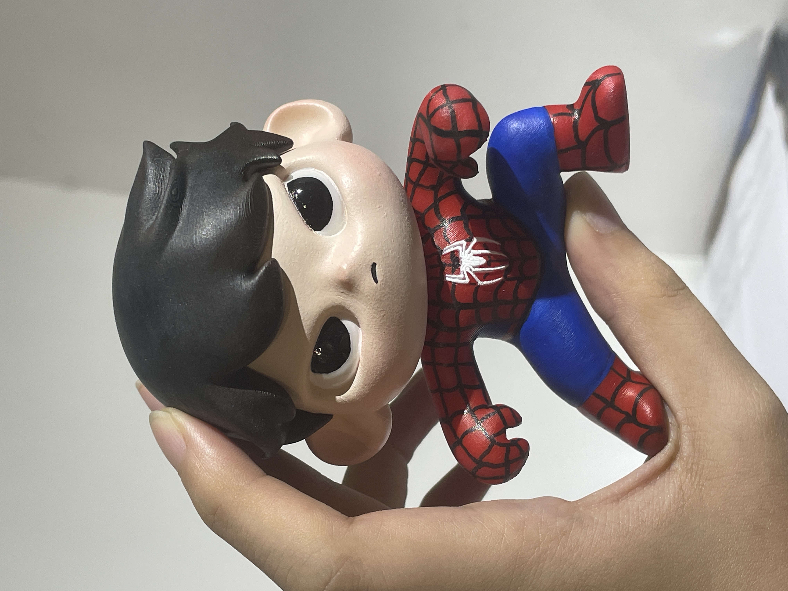

---

# Original Character: AI × 3D Modeling

---

## What is this?

This is a creative learning activity that combines AI generation, character design, and digital modeling. Students will start from their own traits and styles, use AI tools (such as ChatGPT/Doubao AI, Tripo) to spark inspiration and generate character appearances, then further use Nomad Sculpt for character modeling and part splitting, and finally 3D print their physical works.

From concept to model to physical work, students are encouraged to create their own original characters and build basic concepts of digital modeling and 3D printing.

## Key Features

- Use AI tools to brainstorm original character themes, integrating personal style and ideas.
- Develop character appearance, style, accessories, and personality, training narrative and visual transformation abilities.
- Experience the complete creative process: from creative ideation/AI inspiration → modeling → part splitting → printing → painting.
- Encourage the development of personal artistic style, strengthening creative thinking and expressive ability.

This is an immersive creative experience combining technology and art—not just making a cute character, but creating a one-of-a-kind, unique character.

## What will you learn?

Students will personally complete the creative ideation, appearance design, and 3D model realization of their characters, cultivating the following core abilities:

**Creative Ideation and Character Design Thinking**

- Use ChatGPT/Doubao AI to create reference images for character appearance design.
- Use Tripo AI to generate the prototype of the character's 3D model.

**Digital Modeling and Sculpting Skills**

- Use Nomad Sculpt to modify models, build structure, and sculpt details.
- Master symmetrical modeling, proportion adjustment, and basic part splitting techniques.

**Digital to Physical Operation**

- Model part splitting and export STL/OBJ files.
- Use slicing software to set 3D printing parameters.
- Understand the 3D printing process and post-processing.

**Artistic Expression and Style Painting**

- Learn basic acrylic painting techniques for models.
- Practice color design for consistent character style.

## What you need

### Hardware

| Item                  | Description                                   | Quantity | Required/Optional |
|-----------------------|-----------------------------------------------|----------|-------------------|
| iPad or Android Tablet| Installed Nomad Sculpt, stylus recommended    | 1        | ✅                |
| Computer and Mouse    | Organize and transfer 3D model files          | 1        | ✅                |
| 3D Printer            | Print character models                        | 1        | ✅                |

### Software

| Item                  | Description                                   | Quantity | Required/Optional |
|-----------------------|-----------------------------------------------|----------|-------------------|
| Nomad Sculpt          | For 3D modeling                               | 1        | ✅                |
| Tripo AI / Tripo Studio| AI model prototyping and part splitting      | 1        | ✅                |
| ChatGPT / Doubao AI              | Concept ideation and character reference images| 1        | ✅                |
| Slicer                | 3D printing setup, convert models to printable format | 1 | ✅         |

### Tools & Materials

| Item                  | Description                                   | Quantity | Required/Optional |
|-----------------------|-----------------------------------------------|----------|-------------------|
| Stylus                | Improve modeling accuracy                     | 1        | ✅                |
| Sandpaper             | Polish model surface                          | 1        | ✅                |
| Glue                  | Assemble model parts                          | 1        | ✅                |
| Acrylic Paint + Brushes| Paint models                                 | 1 set    | ✅                |

## How it works

The production process is as follows:

1. AI Inspiration Generation: Use ChatGPT/Doubao AI to assist in generating reference images.
2. AI Model Prototyping: Use Tripo to generate 3D model prototypes and basic part splitting.
3. 3D Modeling Modification: Import into Nomad, adjust appearance, sculpt details, and adjust part components.
4. Part Export: Disassemble components and export STL/OBJ.
5. 3D Printing: Print single-color models.
6. Painting and Assembly: Hand-paint and assemble parts to complete the physical character.

## Course Plan

### Course Objectives

- Master the process of creative ideation and tool integration.
- Build basic 3D modeling and sculpting skills.
- Practice the complete process from AI → 3D modeling → 3D printing, turning digital into physical.

## Course Outline

Total sessions: 6, each about 120 minutes

Goal 1: Character Ideation and Digital Modeling Basics

### Lesson 1: Character Concept × AI Ideation and Prototyping

**Practice:** Use ChatGPT/Doubao AI to brainstorm character appearance, generate character design images, and use Tripo to generate 3D models.  

**Duration:** 120 minutes  

**Corresponds to:** Character ideation, AI image and model generation practice

Goal 2: Building Character Prototypes and Basic Structure

### Lesson 2: Building Character Prototypes and Basic Proportions

**Practice:** Use Tripo to generate character model prototypes, import into Nomad Sculpt to learn its interface and basic operations.  

**Duration:** 120 minutes  

**Corresponds to:** Hands-on practice with sculpting tools, adjusting model prototypes

Goal 3: Mastering Sculpting Tools and Detail Modeling Skills

### Lesson 3: Detail Sculpting and Personalized Part Design

**Practice:** Sculpt details such as eyes, mouth, hairstyle, clothing, and add personalized decorations (e.g., accessories, logos, expressions).  

**Duration:** 120 minutes  

**Corresponds to:** Modify and creatively design character details, adjust model structure for 3D printing

Goal 4: Basic Part Splitting and Digital-to-Physical Preparation

### Lesson 4: Model Part Splitting and Exporting Print Files

**Practice:** Create connection structures and pegs, export STL/OBJ files, and simulate the printing process in slicing software.  

**Duration:** 120 minutes  

**Corresponds to:** Understand the necessity and principles of 3D model part splitting, methods for handling part splitting, learn slicing software operation and printing parameter adjustment

Goal 5: Character Realization and Assembly Production

### Lesson 5: Model Printing, Polishing, and Assembly

**Practice:** Polish and glue the physical model after single-color part printing, confirm structural completeness.  

**Duration:** 120 minutes  

**Corresponds to:** Introduction to 3D printing technology, common materials and equipment, post-processing techniques, assembly and handcrafting

 

Goal 6: Creative Painting and Character Presentation

### Lesson 6: Model Painting and Character Introduction

**Practice:** Use acrylic paint to paint the model, design color schemes and handle layers  

**Duration:** 120 minutes  

**Corresponds to:** Color application, aesthetic expression, work presentation

 

## AI Collaboration Flow

- Combine AI generation with personal style to create unique IP characters.
- Students may design character backstories to enhance character appeal.
- Experience the full process from ideation to 3D printing and painting.

---

> Please prepare relevant materials and tools according to each lesson's progress. 