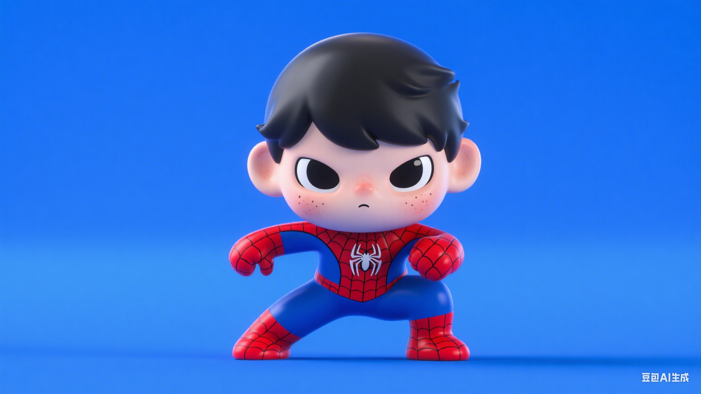
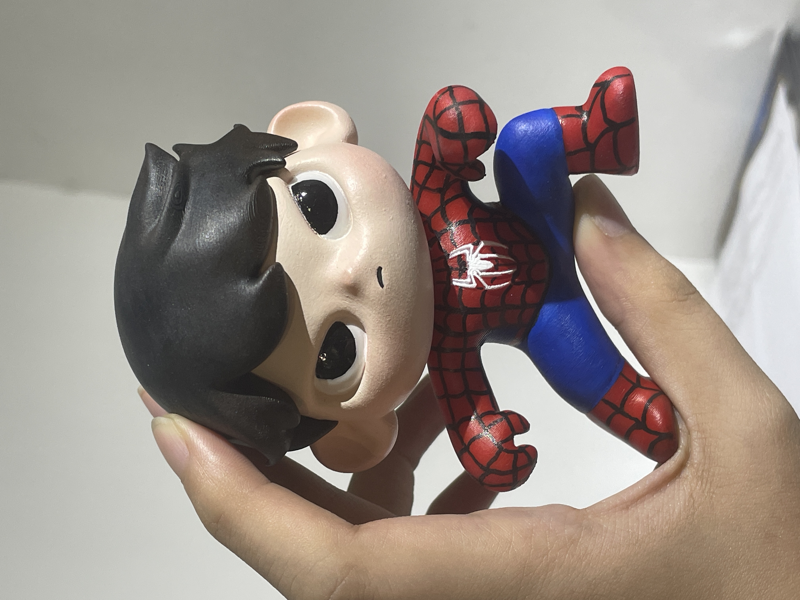
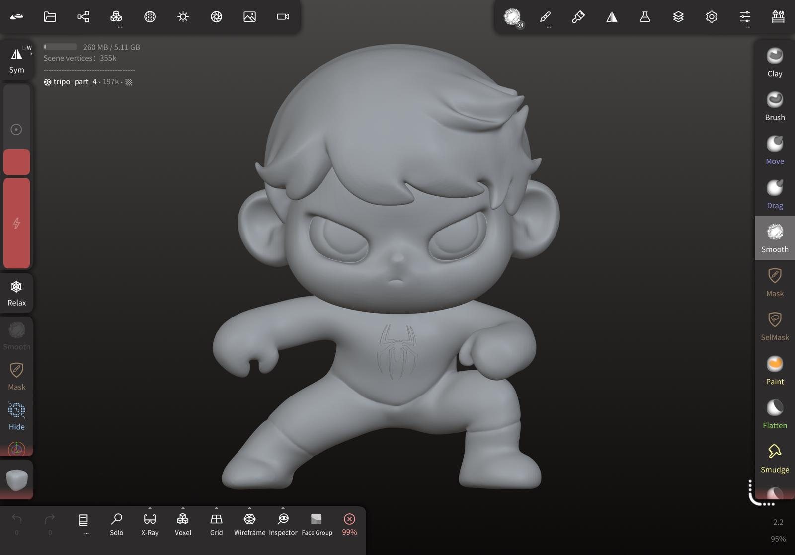
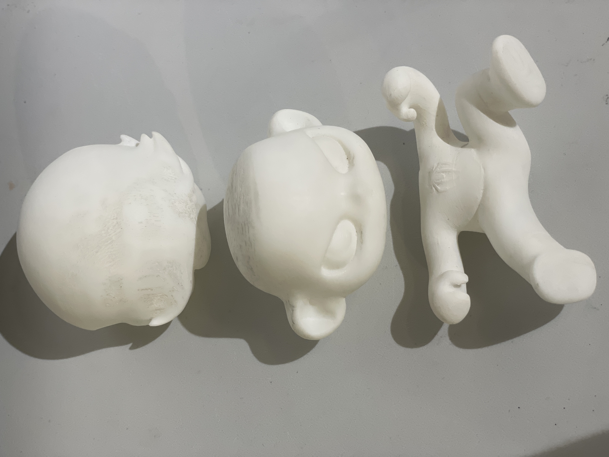
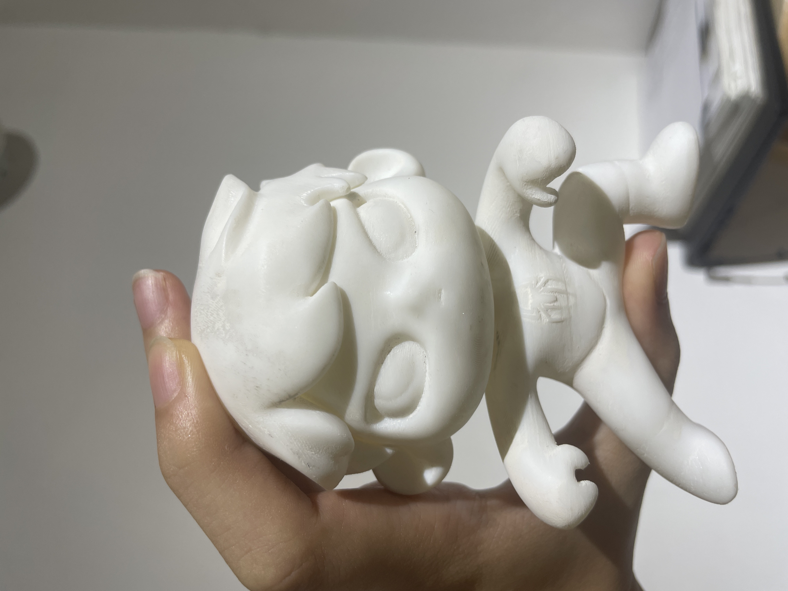
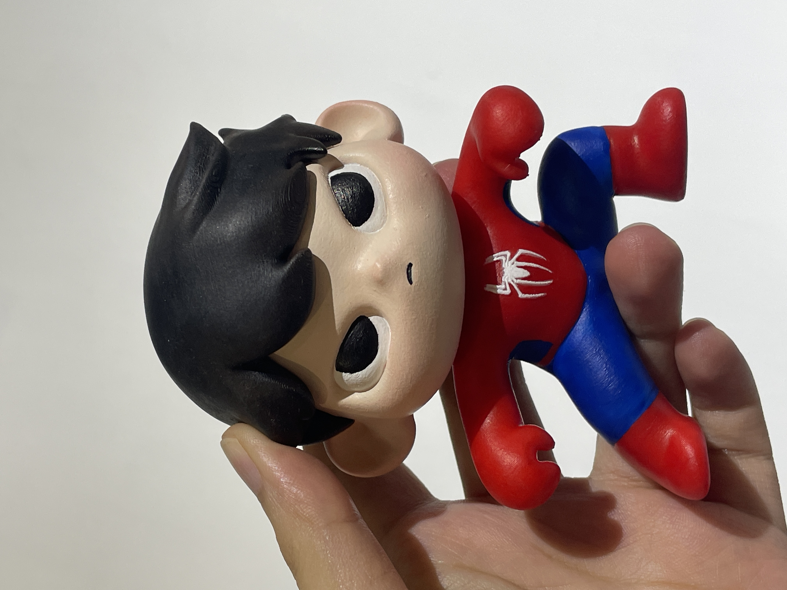

# 原創角色工作坊：AI × 3D建模  

---

## 這是什麼？

這是一個結合人工智慧生成、角色設計與數位建模的創作型學習活動。學生將以個人特質與風格為出發點，透過 AI 工具（如 ChatGPT、Tripo）激發靈感、生成角色造型，再進一步使用 Nomad Sculpt 進行角色建模、分件，並透過3D打印出實體作品。

從概念到模型再到實體作品，鼓勵學生創作屬於自己的原創角色，並建立數位建模及3D打印的基本概念。

## 主要特點

- 利用 AI 工具發想原創角色主題，結合個人風格與理念。

- 建立角色外型、風格、配件與個性，訓練敘事與視覺轉化能力。

- 體驗完整創作流程：從創意構思/ AI 靈感發想 → 建模 → 分件 → 打印 → 上色

- 鼓勵發展個人藝術風格，強化創意思維與表達能力

這是一場結合科技與藝術的沉浸式創作體驗，不只是做出一個可愛角色，更是一次製作出「僅此一個獨一無二角色」的歷程。

## 你將學到什麼？

學生將親自完成角色的創意發想、造型設計與 3D 模型實體轉化，培養以下核心能力：

**創意發想與角色設計思維**

- 使用 ChatGPT 建立角色造型設計參考圖

- 使用 Tripo AI 生成角色3D模型的雛形

**數位建模與雕刻技能**

- 透過 Nomad Sculpt 進行模型修改、結構建構與細節雕刻

- 掌握對稱建模、比例調整與基本分件技巧

**數位轉實體操作**

- 模型分件與匯出 STL/OBJ 檔案

- 使用切片軟體設定 3D 打印參數

- 了解 3D 打印流程與後製處理

**藝術表達與風格上色**

- 學習基礎筆塗塑膠彩的上色技巧

- 練習角色風格一致性的色彩設計

## 你需要的東西

### 硬件（Hardware）

| 項目           | 描述                                 | 數量 | 必需/可選 |
|----------------|--------------------------------------|------|-----------|
| iPad 或 Android 平板 | 已安裝 Nomad Sculpt，建議配手寫筆         | 1    | ✅        |
| 電腦和滑鼠           | 整理與傳輸 3D 模型檔案                | 1    | ✅        |
| 3D 打印機      | 打印角色模型                          | 1    | ✅        |

### 軟件（Software）

| 項目           | 描述                 | 數量 | 必需/可選 |
|----------------|----------------------|------|-----------|
| Nomad Sculpt   | 3D建模用             | 1    | ✅        |
| Tripo AI / Tripo Studio | AI 生成模型雛形與分件 | 1    | ✅        |
| ChatGPT        | 概念發想與角色參考圖 | 1    | ✅        |
| 切片軟體（Slicer） | 進行3D打印設定，轉換模型為可打印格式 | 1    | ✅        |

### 工具與材料（Tools & Materials）

| 項目           | 描述                 | 數量 | 必需/可選 |
|----------------|----------------------|------|-----------|
| 手寫筆         | 提高建模精準度       | 1    | ✅        |
| 砂紙           | 打磨模型表面         | 1    | ✅        |
| 膠水           | 組裝模型零件         | 1    | ✅        |
| 壓克力顏料 + 畫筆 | 為模型上色         | 1組  | ✅        |

## 如何運作

製作流程如下：

1. AI靈感生成：使用 ChatGPT 輔助生成參考圖

2. AI模型初建：使用 Tripo 生成3D模型雛形及基本分件

3. 3D 建模修改：匯入 Nomad，進行外型調整、細節雕刻、分件部件的調整等

4. 分件輸出：進行組件拆解並輸出 STL/OBJ

5. 3D 打印：打印出單色模型

6. 上色與組裝：手工上色與零件組合，完成實體角色

## 課程計劃

### 課程目標

- 掌握創意發想和工具整合的流程

- 建立基本 3D 建模與雕刻能力

- 實踐 AI → 3D 建模 → 3D打印 數位轉實體的完整流程

## 課程大綱 | Course Outline

總課時：6 節 每節時長：約 120 分鐘

目標一：角色構思與數位造型基礎

### 第1堂： 角色概念 × AI 構思與造型雛形

**練習：**使用 ChatGPT 發想角色造型，生成角色設計圖，使用 Tripo 生成3D模型。
**時長：**120 分鐘
**對應：**角色發想、AI圖像及模型生成實作

目標二：建立角色基礎造型與結構

### 第2堂：建立角色雛形與基礎比例  

**練習：**使用 Tripo 生成角色模型雛形，匯入 Nomad Sculpt 認識其介面與基本操作。
**時長：**120 分鐘
**對應：**實作練習使用雕塑工具，調整模型雛形

目標三：掌握雕刻工具與細節建模技巧

### 第3堂：細節雕刻與個性化部件設計

**練習：**進行眼睛、嘴巴、髮型、服裝等細節雕刻，加入個性化裝飾（如配件、標誌、表情）。
**時長：**120 分鐘
**對應：**針對角色細節進行修改與創意設計的調整，模型結構以適合3D打印

目標四：分件組裝基本處理與數位轉實體準備

### 第4堂：模型分件與匯出打印檔案

**練習：**製作連接結構與插銷，匯出 STL/OBJ 檔案，再切片軟件中模擬打印流程。
**時長：**120 分鐘
**對應：**了解3D模型分件的必要性與基本原則、部件分件的的處理方法、學習切片軟體操作與打印參數調整

目標五：角色實體化與組裝製作

### 第5堂：模型打印與打磨組裝

**練習：**分件單色打印後的實體模型打磨與黏合，確認結構完成度。
**時長：**120 分鐘
**對應：**介紹3D打印技術、常見材料與設備、實體後處理技巧、組裝與手作操作

 

目標六：創意上色與角色展示

### 第6堂：模型上色與角色介紹

**練習：**使用壓克力顏料進行模型上色，配色設計與層次處理
**時長：**120 分鐘
**對應：**色彩應用、美感表現、作品展示

 

### AI協作流程說明 | AI Collaboration Flow

- AI生成與個人風格結合，打造獨一無二的IP角色。
- 學員可選擇設計角色故事背景，增強角色吸引力。
- 全流程體驗，從創意到3D列印與上色。

---

> 請依照每堂課的進度，準備相關素材與工具。 