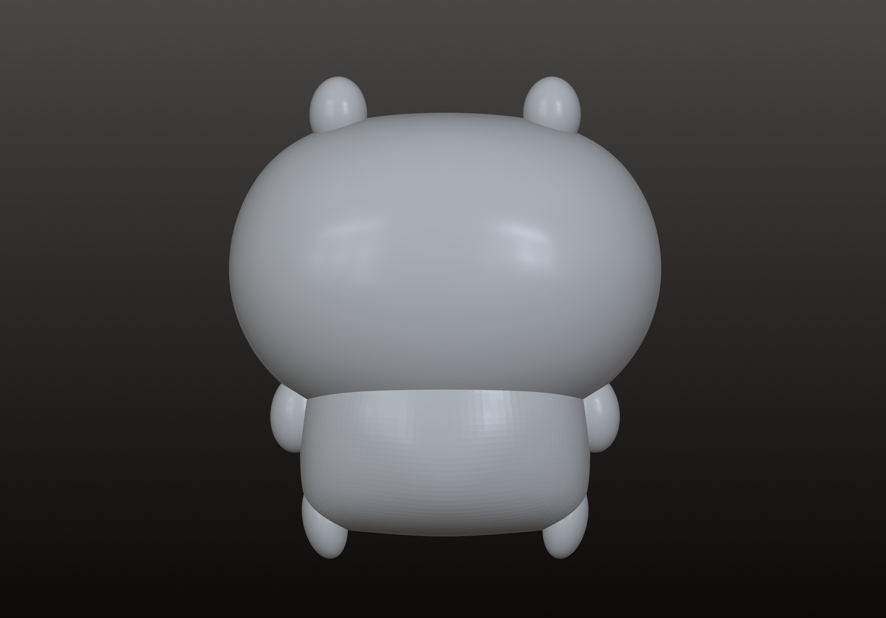

# 專案 02: 創建你的 Chiikawa

這個專案將指導你如何使用 Nomad Sculpt 創建 Chiikawa 3D 模型。請按照以下步驟進行創作。

如果你需要基本的 Nomad Sculpt 教學，請參考 [Nomad Sculpt 指南](../resources/NomadSculpt/index.md)。

## 步驟 1：準備工作

1. 打開 Nomad Sculpt：啟動應用程式，創建一個新的專案。
2. 基本形狀：使用畫面中的球體作為基礎形狀，這將成為 Chiikawa 的頭部。
3. 參考影像：匯入 Chiikawa 的正面參考圖片，調整球體透明度（覆蓋（Overlay））以及圖片位置。

## 步驟 2：基本造型

1. 調整畫面：透過使用手勢將畫面中的球體移到與參考圖片中 Chiikawa 的頭部重疊，方便按照形狀製作。

    > 留意：非使用"軸向變換（Gizmo）"的移動功能，避免影響後續使用對稱功能。

2. 調整頭部形狀：

    * 使用"軸向變換（Gizmo）"的變形功能調整球體的整體形狀
    * 使用"移動（Move）"工具仔細調整球體的形狀

    > 留意：對稱（Symmetry）功能保持開啟，確保左右對稱

3. 製作身體：

    * 透過"新增（Add）"加入新形狀，先製作 Chiikawa 的身體
    * 使用"軸向變換（Gizmo）"的移動功能將新增的形狀移動到頭部的下方

4. 調整身體形狀：

    * 使用"軸向變換（Gizmo）"的變形功能調整整體形狀
    * 按下"轉換（Validate）"後使用"移動（Move）"工具進行細節調整

5. 製作耳朵、尾巴和四肢：

    * 透過新增加入新形狀，製作各個部位
    * 使用"軸向變換（Gizmo）"的移動和旋轉功能調整位置與姿勢
    * 製作對稱部位時，在按下"轉換（Validate）"前按下"映像（Mirror）"

    > 留意：按下"儲存（Save）"亦保存製作進度
        
## 步驟 2.5：製作 Chiikawa 其他角色

### 另存檔案

1. 點擊選單「檔案（File）」→「另存為（Save As）」
2. 將當前模型另存為新檔案（如：Chiikawa_hachiware）

### 重用模型

直接沿用步驟2已完成的頭部與身體結構，無需重新製作。

### 修改耳朵造型

1. 選擇原本的耳朵部件，使用「刪除（Delete）」工具移除舊耳朵
2. 透過「新增（Add）」加入球體或圓柱體
3. 使用「軸向變換（Gizmo）」的縮放與拉伸功能，或「移動（Move）」調整成不同形狀
4. 對稱操作：
    * 若需非對稱設計，關閉「對稱（Symmetry）」
    * 若保持對稱，可先製作單側後使用「映像（Mirror）」複製另一側

### 新增/調整尾巴

1. 選擇原本的尾巴部件，使用「刪除（Delete）」工具移除舊尾巴
2. 在身體後方「新增（Add）」→「圓管（Tube）」作為尾巴
3. 畫出尾巴擺動的形狀/型態：
    * 拖動白色圓點以改變形狀/型態
    * 可以在線段新增白色圓點
4. 調整圓管參數：
    * 開啟「半徑（Radius）」調整粗幼度

### 定位與變形

1. 使用「軸向變換（Gizmo）」的「移動（Move）」工具，將圓管移到身體後方的位置
2. 使用「縮放（Scale）」工具，調整整體的粗幼度，增加造型變化
3. 進階細節：用「黏土（Clay）」或「膨脹（Inflate）」工具塑造尾巴特色

    > 留意：按下"轉換（Validate）"後使用

### 快速檢查比例

切換視角確認耳朵與尾巴與身體的比例，避免尺寸失衡。

## 步驟 3：添加細節

1. 雕刻面部細節：
    * 使用"細分（Subdivide）"增加網格
    * 雕刻眼睛和嘴巴的位置與細節
    * 添加球體作為眼球，調整大小與位置
    * 使用"平滑（Smooth）"消除棱角
    * 使用"膨脹（Inflate）"加強臉頰圓潤感

## 步驟 4：添加顏色及視覺上的後期處理

1. 為 Chiikawa 填色：
    * 使用"繪畫（Paint）"工具
    * 調整粗糙度及金屬度，呈現不同質感

2. 後期處理：
    * 調整整體的視覺效果呈現（如色調（Color Grading））
    * 開啟"環境光遮蔽（Ambient Occlusion）"加強陰影與立體感

## 步驟 5：完成和導出

1. 檢查模型：仔細檢查模型的每個細節，確保沒有遺漏

2. 導出模型：
    * 如需要 3D 打印，先揀選所有部件
    * 使用"布林（Boolean）"使其合成一件
    * 將完成的 Chiikawa 模型導出為打印所需的格式（.stl/.obj）

## 練習

## 等級 1：基礎 Chiikawa

按照主要教程步驟製作  

## 等級 2：自創角色

創作你自己獨特的角色  

## 結論

恭喜你完成了 Chiikawa 的創作！你現在可以嘗試創作不同的角色或探索更多進階功能。祝你創作愉快！ 
