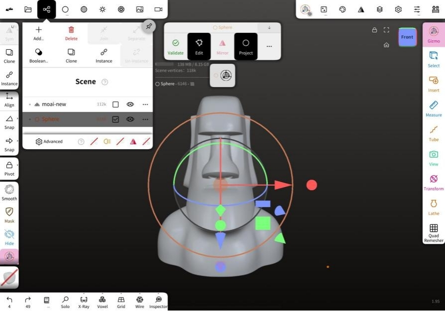

# Project 01: Create Your Moai

## Preparation

[Download a free Moai 3D file](https://www.thingiverse.com/thing:144668) from [Thingiverse](https://www.thingiverse.com/), and save it on the tablet.

## Import a Moai

1. Click "File" on the top menu

2. Select "Import" from the drop-down menu

3. Choose the Moai file

4. Click on "New (Project)"

## Save Your Moai

1. Select "Gizmo" on the toolbox to rotate the moai 

2. Select tools on the toolbox to modify your moai

3. Save your moai as a 3D file project

## Exercise

### Level 1

### Level 2

## Reference

### No. 001

**Solution:**

1. Use "SelMask" on the toolbox
   
2. Mask the eyes by using "Rect" selector
   
3. Use "Move" to change the mouth
   
4. Use "Smooth" to remove the bumpy parts
   
5. Clear the mask

### No. 002

**Solution:**

1. Use "SelMask" on the toolbox
   
2. Mask the eyes by using "Rect" selector
   
3. Use "Move" to change the eyebrows and mouth
   
4. Use "Smooth" to remove the bumpy parts
   
5. Clear the mask

### No. 004

**Solution:**

1. Click "Scene" on the top menu
   
2. Click "Add..."
   
3. Select a shape from "Primitive"
   
4. Use "Gizmo" on the toobar for moving
   
5. Click "Mirror" on the primitive toolbar to toggle placing a mirror repeater above the primitive

### No. 005

**Solution:**

1. Click "Scene" on the top menu 

2. Click "Add..."

3. Select a shape from "Primitive"

4. Use "Gizmo" on the toobar for moving

5. Use "Gizmo" on the toobar for scaling
