# 組裝指南

本指南將帶您完成步行機器人的組裝過程。組裝分為三個主要部分：

1. **機械組裝**：包括所有物理組件，如馬達、腿部、主板和遙控器。
2. **編程**：使用 Micro:bit 設置機器人和遙控器的軟件。
3. **測試和校準**：指導您測試組裝好的機器人並校準其動作以獲得最佳性能。

讓我們從機械組裝開始。

## 1. 機械組裝
### 1.1 馬達模組安裝

{ width=200px }  

**涉及的部件：**

| 項目               | 描述                | 數量 | 圖片                |
|--------------------|----------------------------|----------|----------------------|
| 馬達 (N20 DC 馬達 6V 60rpm) | 用於驅動的小型直流馬達 | 2        | { width=50px }  |
| part-motor-case.stl         | 馬達的外殼    | 1        | { width=50px } |

**視頻說明**

[觀看組裝視頻](https://youtube.com/shorts/HkKQfT87Ntc?feature=share)

### 1.2 左右腿組裝

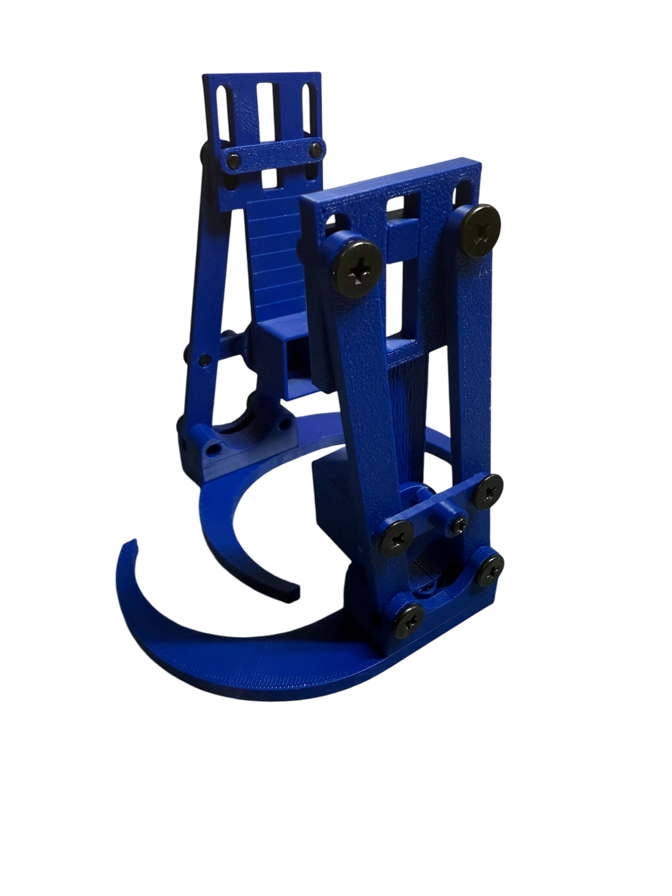{ width=200px }  

**涉及的部件：**

| 項目                                             | 描述                       | 數量 | 圖片 |
|--------------------------------------------------|-----------------------------------|----------|-------|
| part-frame.stl        | 主要機身組件                | 2        | { width=50px }      |
| part-control-bar-bottom.stl | 控制桿（底部）組件       | 2        | { width=50px }      |
| part-control-bar-top.stl | 控制桿（頂部）組件       | 2        | 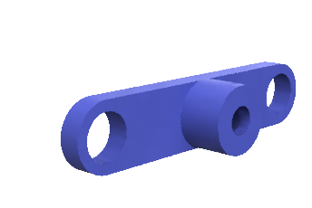{ width=50px }      |
| part-foot.stl  | 腳部組件                     | 2        |  { width=50px }       |
| part-foot-palm.stl  | 腳掌組件                     | 2        |  { width=50px }       |
| part-foot-sole.stl  | 腳底組件（可選）              | 2        |  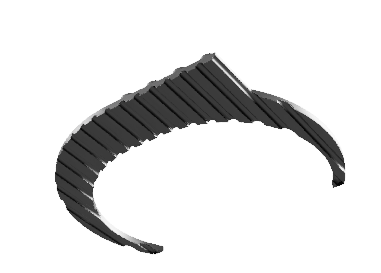{ width=50px }       |
| part-leg-main.stl  | 腿部主要組件                     | 2        |  { width=50px }       |
| part-gear.stl  | 齒輪組件                     | 2        |  { width=50px }       |
| part-screw-M4x5  | M4X5 螺絲                      | 4        |  { width=50px }       |
| part-screw-M4x10  | M4X10 螺絲                     | 8        |  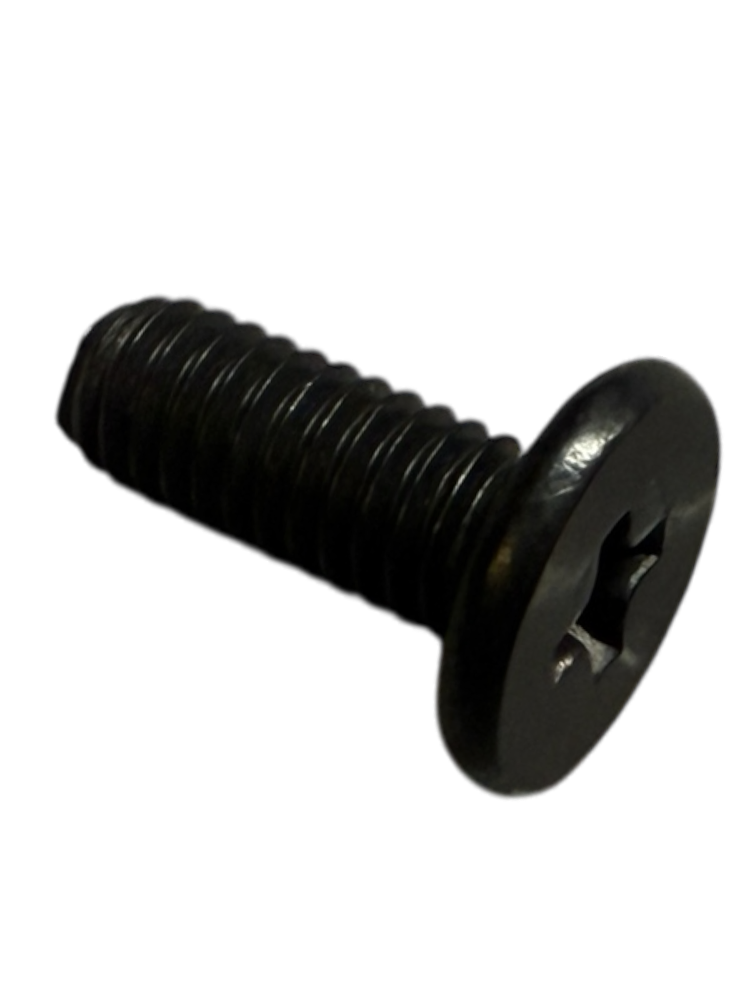{ width=50px }       |
| part-gear.stl  | 小螺絲                      | 2        |  { width=50px }       |

**視頻說明**

[觀看組裝視頻](https://youtu.be/bTmAOl0an0w)

* 請重複組裝兩次。

### 1.3 主框架和主板安裝

{ width=200px }  

**涉及的部件：**

| 項目                                             | 描述                       | 數量 | 圖片 |
|--------------------------------------------------|-----------------------------------|----------|-------|
| part-main-frame.stl        | 主要機身組件                | 1       | 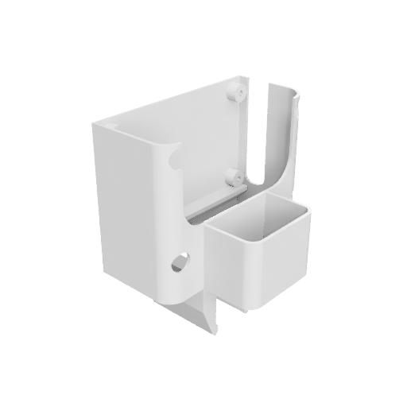{ width=50px }      |
| part-battery-case| 電池盒       | 2        | 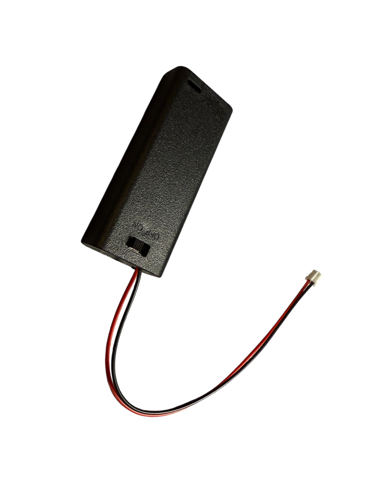{ width=50px }      |
| micro:bit        | Micro:bit               | 1       | { width=50px }      |
| Beets 控制板    | 整合所有電子元件的控制板                | 1       | 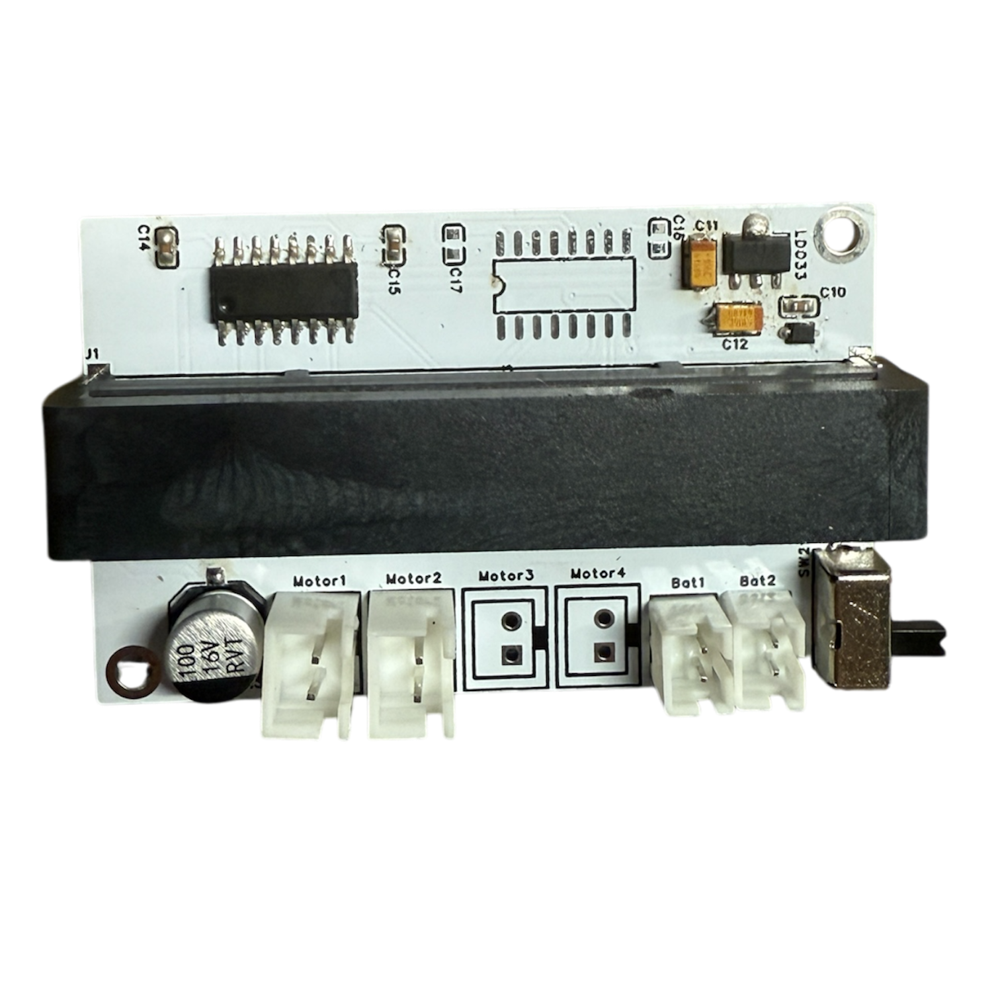{ width=50px }  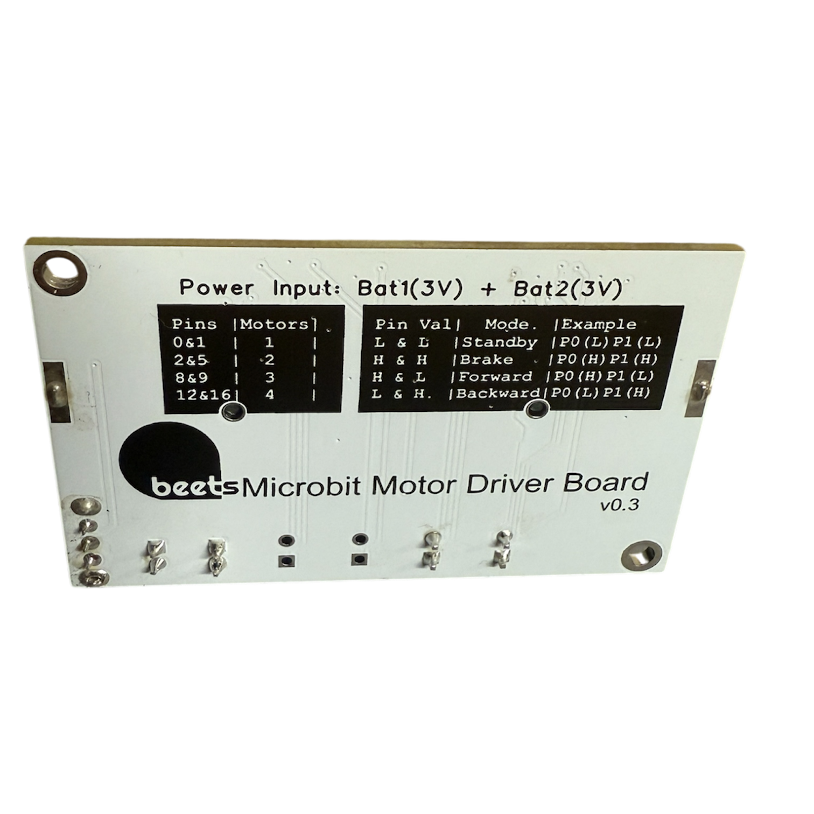{ width=50px }      |
| 腿部組件       | 1.2 節的腿部組裝           | 1       | { width=50px }      |
| 馬達模組       | 1.1 節的馬達模組組裝           | 1       | { width=50px }      |

**視頻說明**

[觀看組裝視頻](https://youtu.be/52bUlyzyBPc)

### 1.5 機身和外殼

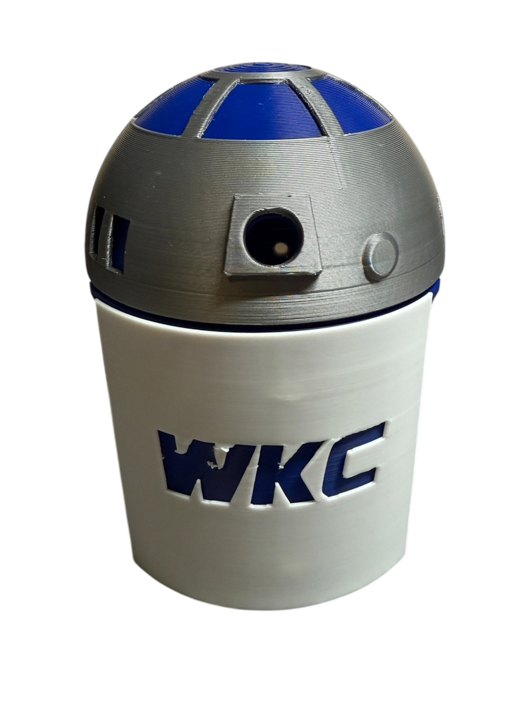{ width=200px }  

**涉及的部件：**

| 項目                                             | 描述                       | 數量 | 圖片 |
|--------------------------------------------------|-----------------------------------|----------|-------|
| part-body.stl        | 主要機身組件                | 1        | { width=50px }      |
| part-head.stl | 頭部組件       | 1        | { width=50px }      |
| part-shell-front.stl | 前殼組件       | 1       | { width=50px }      |
| part-shell-back.stl | 後殼組件       | 1      | { width=50px }      |
| component-main-frame | 上一節組裝的主框架組件      | 1      | { width=50px }      |

**視頻說明**

[觀看組裝視頻](https://youtube.com/shorts/O2Bp6h6s_oI)

### 1.7 遙控器

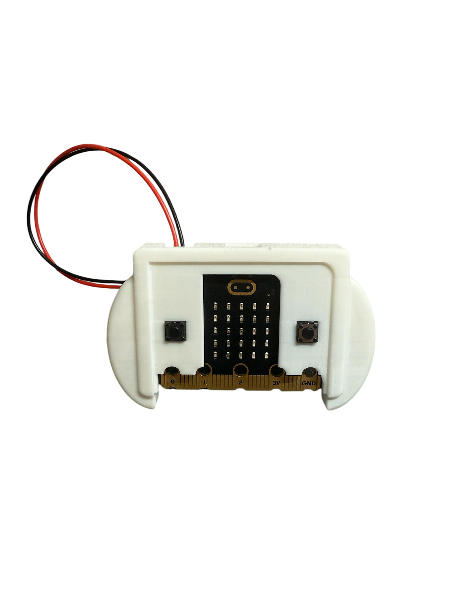{ width=200px }  

**涉及的部件：**

| 項目                                             | 描述                       | 數量 | 圖片 |
|--------------------------------------------------|-----------------------------------|----------|-------|
| part-controller-main.stl        | 主要機身組件                | 1        | 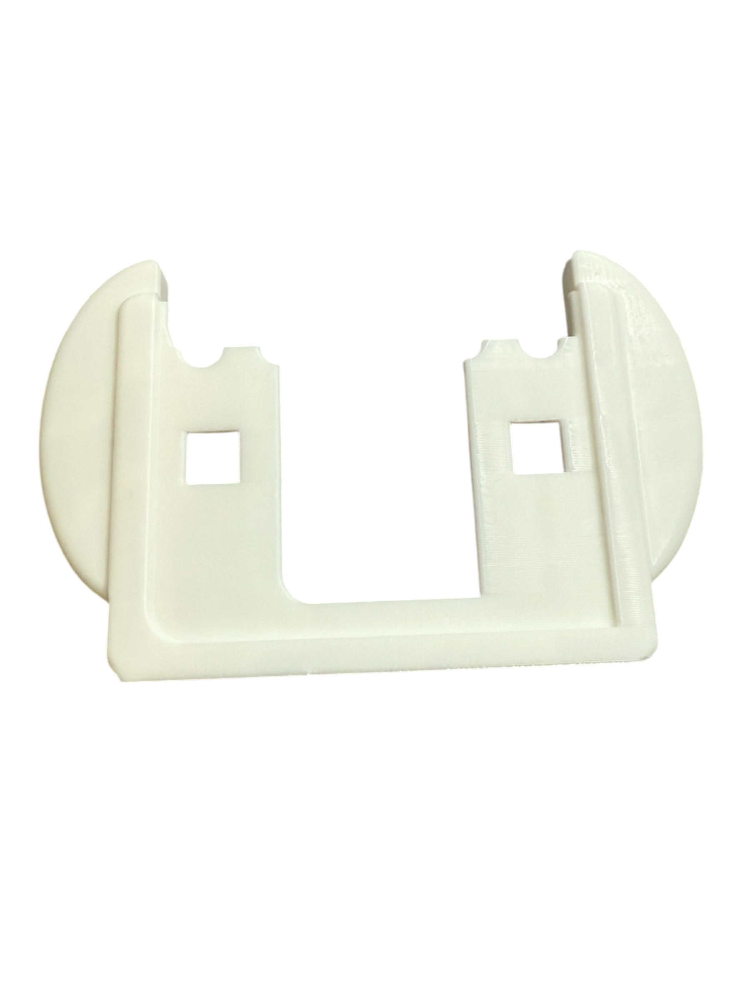{ width=50px }      |
| part-controllor-battery.stl | 電池盒支架       | 1        | 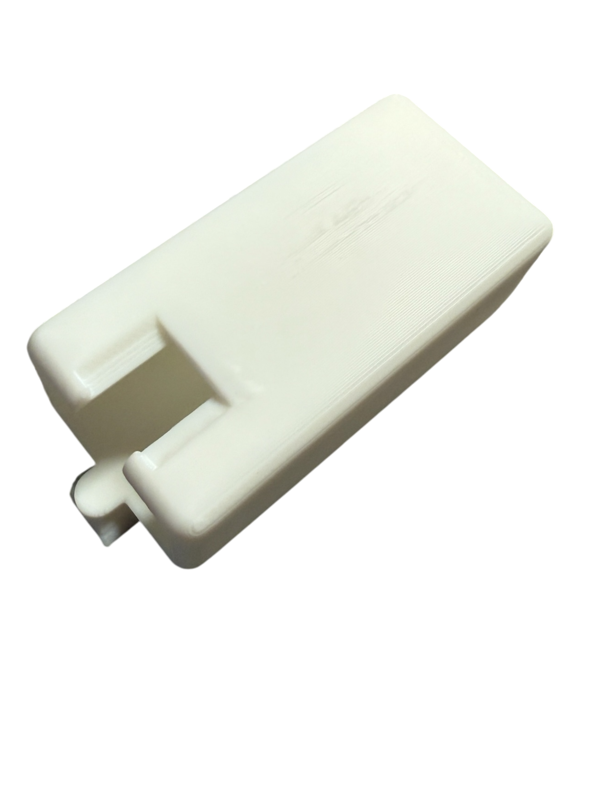{ width=50px }      |
| part-battery-case| 電池盒       | 1        | { width=50px }      |
| part-microbit | microbit                   | 1        |  { width=50px }       |

您可以從此連結下載 stl 文件
[在此下載 stl 文件](https://www.printables.com/model/248633-bbc-microbit-controller-case-with-detachable-batte/files)

**視頻說明**

[觀看組裝視頻](https://youtube.com/shorts/qm5MiA7BIWI)

## 2. 編程

在本節中，您將使用 Microsoft MakeCode。

1. 可以通過 https://makecode.microbit.org/# 訪問
2. 您需要註冊一個帳戶

獲得帳戶後，請繼續下一步。

{ width=500px }  

### 2.1 使用 MakeCode 進行基本的 Micro:bit 編程

1. 點擊"導入"按鈕
2. 選擇"導入 URL"

{ width=500px }  
3. 打開項目 URL，輸入：https://github.com/beets3d/b3d1-walking-bot-main
{ width=500px }  

**請注意：** 如果您使用多個步行機器人，您應該為"無線電設置組"分配唯一的編號。請記住在下一個部分的遙控器中也要更改此設置。

{ width=200px } 

4. 使用 USB 線連接您的 micro:bit，然後點擊"下載"

### 2.2 遙控器設置

重複上述步驟，使用此項目 URL：https://github.com/beets3d/b3d1-walking-bot-controller

## 3. 測試和校準

**視頻說明**

[觀看測試和校準視頻](https://youtu.be/MfOPkmcqLCs)

---

## 注意事項
- 在組裝過程中，請確保遵循安全指導。
- 測試每個步驟，確保所有部件正常運作。 