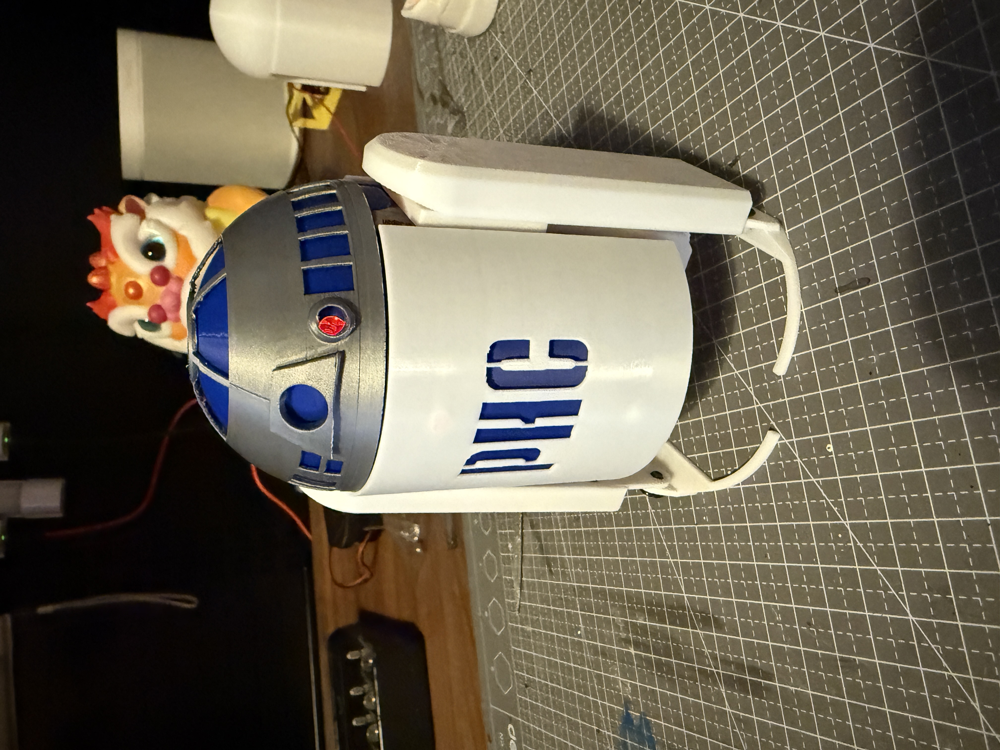

# Walking Robot Project

## What is this?

A walking crank robot that demonstrates fundamental walking mechanism concepts through hands-on experimentation. This educational platform allows students and teachers to explore how different physical attributes affect robot locomotion. By modifying key components like leg length and foot design using LEGO blocks, students can investigate:

- Walking speed and efficiency
- Robot stability and balance
- Different walking gaits and patterns

Understanding the concepts of walking mechanisms, balance, and motion dynamics is crucial for developing a deeper understanding of robotics. For details, please refer to the [Concepts of Walking](concept-of-walking.md) page.

Key Features:

- Modular design compatible with LEGO blocks for easy modification
- Basic walking functions (forward/backward movement)
- Remote control capability
- Customizable foot attachments for experimenting with different designs
- Adjustable leg lengths to explore optimal walking configurations

Key Components:

- Micro:bit x 2
- Main board x 1
- geared motors x 2
- motor driver board x1
- Battery pack
- Jumper wires
- 3D printed parts
- Outter shell
- LEGO blocks

The robot serves as an excellent teaching tool for understanding mechanical principles, robotics fundamentals, and the relationship between design choices and movement outcomes.

## What you will learn
- **Mechanical Principles**: Walking mechanisms, balance, motion dynamics
- **Design & Experimentation**: Testing different foot designs, leg lengths, and their effects on robot movement
- **Electronics**: Working with micro:bit, motor control, basic circuitry
- **Engineering**: Understanding gear systems, mechanical advantage, torque
- **Problem Solving**: Analyzing movement patterns, improving stability, optimizing performance
- **Documentation**: Recording observations, comparing different configurations
- **Teamwork**: Collaborative experimentation, sharing findings
- **STEM Integration**: Connecting physics concepts with real-world robotics applications

## What you need

### Hardware

- 2x BBC micro:bit
- 1x Main control board ()
- 2x Geared motors
- 1x Motor driver board
- 1x Battery pack
- Jumper wires
- 3D printed parts (chassis and mechanical components)
- Outer shell components
- LEGO blocks (for modifications)
- USB cable for programming

### Software
- MakeCode for micro:bit (web-based programming platform)
- 3D printing software (for customizing parts)

### Tools
- Screwdriver
- Wire cutters/strippers (for jumper wires)
- 3D printer access (for parts)

### Age
Suitable for ages 11-14 

## How it works

### Design Process
1. Understanding the Walking Mechanism
   - Crank-based walking principles
   - Balance and weight distribution
   - Motor and gear system operation

2. Customization Options
   - LEGO attachment points for feet
   - Adjustable leg lengths
   - Modifiable walking patterns

### Assembly Guide
1. Mechanical Assembly
   
   - 3D printed parts connection
   - Motor and gear installation
   - LEGO attachment points setup

2. Electronics Setup
   
   - Micro:bit installation
   - Motor driver connections
   - Battery pack setup
   - Wiring diagram

3. Programming
   - Basic movement controls
   - Remote control setup
   - Testing and calibration

## Lesson Plan
1. **Day 1: Introduction and Design** (45 min)
   - Walking mechanism principles
   - Robot components overview
   - Safety guidelines
   
2. **Day 2: Assembly** (45 min)
   - Mechanical assembly
   - Electronics connection
   - Initial testing
   
3. **Day 3: Programming** (45 min)
   - MakeCode basics
   - Movement programming
   - Remote control setup
   
4. **Day 4: Experimentation** (45 min)
   - Foot design testing
   - Performance optimization
   - Documentation of results

## Exercise
1. Basic Walking Test
   - Forward/backward movement
   - Speed measurement
   - Stability assessment

2. Design Challenges
   - Create different foot designs
   - Test various leg lengths
   - Compare walking efficiency

3. Documentation
   - Record observations
   - Compare different configurations
   - Present findings

## Student / Teacher Materials
### Student Resources

- Assembly guide with pictures
- Programming tutorial
- Experiment worksheet
- Design challenge tasks

### Teacher Resources
- Detailed lesson plans
- Assessment rubrics
- Troubleshooting guide
- Extension activities
