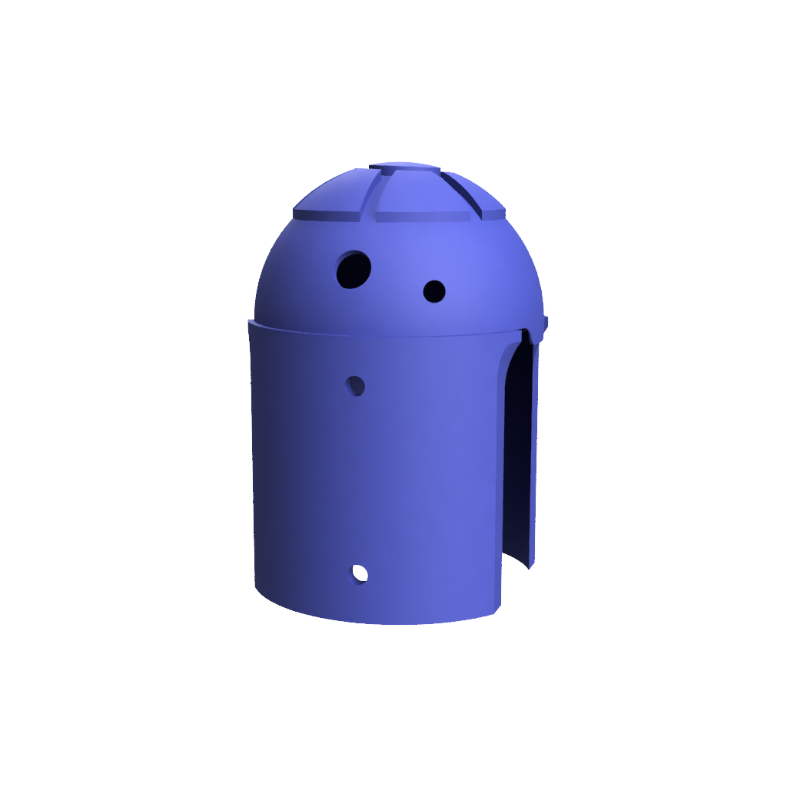

# 行走機械人 (B3D1) 項目 

---

## 這是什麼？

B3D1 這個名字可能會讓人想起 R2D2，但它實際上代表「Beets 3D1mension」，是對 Beets3D 這個創新公司及其團隊的致敬，該團隊在這個令人興奮的項目中發揮了重要作用。

  { width=30% }
  { width=30% }
  { width=30% }

這個行走曲柄機械人作為基本行走機制概念的實際演示，通過引人入勝的實驗提供了一個教育平台，讓學生和教師探討各種物理特徵如何影響機械人的運動。通過使用 LEGO 積木改變腿長和腳設計等基本組件，學生可以探索：

- 行走速度和效率
- 機械人的穩定性和平衡
- 各種行走步態和模式

掌握行走機制、平衡和運動動力學的原則對於加深對機器人的理解至關重要。欲了解更多信息，請參閱 [行走概念](concept-of-walking.md) 頁面。

主要特點：

- 設計易於修改，配有可互換的部件
- 能夠向前行走，並具備向左或向右轉的能力
- 腳部附件可使用 LEGO 積木自定義，允許進行不同腿長和腳設計的實驗
- 配備遙控功能，嘗試各種行走模式

這個機械人作為一個強大的教育資源，使學習者能夠掌握基本的機械原則、機器人學的基礎概念，以及設計決策與運動性能之間的複雜聯繫。

---

## 你將學到什麼
- **機械原則**：行走機制、平衡、運動動力學
- **設計與實驗**：測試不同的腳部設計、腿長及其對機械人運動的影響
- **電子學**：使用 micro:bit、馬達控制、基本電路
- **編程**：編程控制機械人及遙控
- **工程學**：理解齒輪系統、機械優勢
- **問題解決**：分析運動模式、改善穩定性、優化性能
- **文檔編寫**：記錄觀察結果，對比不同配置
- **團隊合作**：協作實驗，分享發現
- **STEM 整合**：將物理概念與現實機器人應用相連接

### 你需要的東西

**硬件**

| 項目                                         | 描述                                                                 | 數量 | 必需/可選 |
|----------------------------------------------|-----------------------------------------------------------------------------|----------|----------|
| BBC micro:bit                               | 用於控制機械人的緊湊型微控制器                          | 2        | Y        |
| 用於編程的 USB 線                            | 用於編程 micro:bit 的電纜（本項目使用 V2）    | 1        | Y        |
| 主控制板                                   | 用於連接 micro:bit 的板，包括馬達驅動器和電池包 | 1        | Y        |
| AAA 電池                                   | 機械人的電源                                                 | 4        | Y        |
| 齒輪馬達 (N20 DC 馬達)                      | 提供運動所需的扭矩和速度的馬達                              | 2        | Y        |
| 3D 打印部件                                 | 底盤和機械部件（鏈接到 STL 文件）                          | 各種  | Y        |
| 外殼部件                                   | 機械人的外部外殼                                             | 各種  | Y        |
| 螺絲 M4X10                                  | 用於組裝的螺絲                                                        | 8        | Y        |
| 螺絲 M4X5                                   | 用於組裝的螺絲                                                        | 4        | Y        |
| 螺絲 M2                                     | 用於組裝的小螺絲                                               | 2        | Y        |
| LEGO 積木                                   | 用於修改和自定義                                        | 各種  | N        |

**軟件**

| 項目                                         | 描述                                                                 | 必需/可選 |
|----------------------------------------------|-----------------------------------------------------------------------------|----------|
| MakeCode for micro:bit                      | 基於網頁的編程平台或使用 iPad 應用                           | Y        |
| 行走機械人的主要代碼                       | [代碼鏈接](https://beets3d.github.io/b3d1-walking-bot-main/)         | Y        |
| 遙控器的代碼                                | [代碼鏈接](https://beets3d.github.io/b3d1-walking-bot-controller/)   | Y        |
| 3D 打印軟件                                 | 用於自定義部件，建議使用 Fusion 360                        | N        |

**工具**

| 項目                        | 描述                                         | 必需/可選 |
|-----------------------------|-----------------------------------------------------|----------|
| 螺絲刀                     | 用於組裝和拆卸部件的工具    | Y        |
| 電線剪/剝線鉗              | 用於剪切和剝去跳線的工具         | Y        |
| 3D 打印機訪問           | 用於打印 3D 模型的 3D 打印機      | N        | 

---

## 如何運作
{ width=80% }

### 設計

**核心行走機制**
   - **馬達單元** - 由 2 個齒輪馬達組成，提供機械人運動所需的扭矩和速度。這些馬達的位置經過精心設計，以優化行走機制，實現平穩和協調的腿部運動。齒輪設計提高了動力傳輸的效率，確保機械人能夠有效地在各種地形上行駛。 
   {: style="width: 50%; display: block; margin-left: auto; margin-right: auto;"}

   - **腿（左/右）** - 由一個模擬擺動行走的機制組成。這種設計使腿部能夠平穩地前後移動，模仿人類腿部的行走。腳部包括一個兼容 LEGO 的附件，便於自定義和更改腳部設計。這一特性鼓勵對不同形狀和大小的實驗，以觀察它們如何影響機械人的運動和平衡。

   {: style="width: 30%; display: inline-block; margin-right: 10px;"} {: style="width: 30%; display: inline-block;"}
      
   {: style="width: 30%; display: inline-block; margin-right: 10px;"} {: style="width: 30%; display: inline-block;"}

**電子學**
   - **主板** - 作為機械人的中央樞紐，設有專用插槽供 micro:bit 單元使用，作為大腦。它集成了馬達驅動器，並促進了馬達和電池包之間的無縫連接，確保高效的電力分配和控制。

  - **Micro:bit** - Micro:bit 是一款緊湊且多功能的微控制器，旨在用於教育目的。它配備了一系列傳感器、按鈕和 LED 燈，非常適合編程和機器人項目。在這個機械人中，Micro:bit 作為大腦，控制馬達並處理用戶的輸入。 

      {: style="width: 30%; display: inline-block; margin-left: auto; margin-right: auto;"} {: style="width: 30%; display: inline-block;margin-left: auto; margin-right: auto;} 

   - **電池盒** - 電池盒設計用於安全地容納機械人的電源，確保電池受到保護並易於更換。設計良好的電池盒有助於機械人的整體穩定性，保持低重心，這對於有效的行走至關重要。適當的重量分配有助於防止翻倒，增強機械人在運動過程中的平衡。

**外殼**
   - **機身**- 這是行走機械人的主要機身，旨在容納內部組件並為腿部和頭部提供結構支持。
      {: style="width: 50%; display: block; margin-left: auto; margin-right: auto;"}

   - **頭部** - 此組件作為機械人的頭部，提供視覺表示並容納任何必要的傳感器或互動功能。這可以根據學習需求進行自定義。
      {: style="width: 50%; display: block; margin-left: auto; margin-right: auto;"}
   - **外殼** - 此組件為機械人提供外部外殼，提供良好的外觀並根據需求進行自定義。  
      {: style="width: 50%; display: block; margin-left: auto; margin-right: auto;"}

**遙控**
您可以使用另一個 Micro:bit 來控制行走模式，通過按下 A 或 B 按鈕。每個按鈕對應一條腿的運動；按下按鈕將使相關的腿向前邁步。例如，假設 A 按鈕控制左腿，B 按鈕控制右腿。當您按下 A 按鈕時，左腿將向前邁步；當您按下 B 按鈕時，右腿將向前邁步。這種設置使您能夠管理兩條腿的運動時間和動作，提供了一個探索「控制時間」如何影響行走過程中的平衡、速度和方向的機會。

**自定義選項**
   - **LEGO 附件** - 腳部設計允許添加任何 LEGO 附件
      {: style="width: 30%; display: inline-block; margin-left: auto; margin-right: auto;"} 
      {: style="width: 30%; display: inline-block;margin-left: auto; margin-right: auto;"} 

   - **可調腿長** - 通過 LEGO 附件，您可以通過添加 LEGO 積木來調整腿的長度，這將改變每一步的運動範圍。
   - **可調腳形** - 您還可以設計任何形狀以測試不同的行走行為，考慮到平衡。

### 組裝指南
有關詳細的組裝說明，請參閱 [組裝指南](assembly-guide.zh_HK.md)。

---

## 課程計劃

### 課程目標：

- 理解行走機制（平衡、扭矩、步態模式）。
- 使用 B3D1 套件設計和建造一個功能性行走機械人。（可選）
- 整合編程（micro:bit）以進行馬達控制和遙控操作。（可選）
- 實驗修改以優化性能。
- 通過迭代測試和文檔編寫來培養問題解決能力。

### 課程結構

總課時：10 節核心 + 4 節可選
每節時長：40–60 分鐘

##### 目標 1：理解行走機制（平衡、扭矩、步態模式）

- **第 1 節：生物力學基礎**  
  - **練習：** 步態圖示 – 使用人形動畫比較人類/昆蟲的步態。  
  - **時長：** 50 分鐘  
  - **對應：** 平衡、步態模式。  

  有關詳細信息，請參閱 [練習：步態圖示](exercise-gait-diagramming.zh_HK.md)

- **第 2 節：扭矩與平衡**  
  - **練習：** 翹翹板測試 – 使用 LEGO 重量調整機械人在支點上的平衡。  
  - **時長：** 50 分鐘  
  - **對應：** 扭矩、平衡。  

有關詳細信息，請參閱 [練習：翹翹板測試](exercise-teeter-totter-test.zh_HK.md)

##### 目標 2：設計與建造 B3D1 機械人（可選 🔧）  

- **第 3 節：機械組裝與電子設置**  
  - **練習：** 齒輪箱中繼與電路偵探 – 團隊組裝齒輪系統，專注於扭矩傳輸，並診斷接線錯誤（例如，馬達連接鬆動）。  
  - **時長：** 60 分鐘  

有關詳細信息，請參閱 [組裝指南](assembly-guide.zh_HK.md) 

##### 目標 3：整合編程（可選 🔧）  

- **第 4 節：馬達控制基礎**  
  - **練習：** 步數計數器 – 編程機械人向前/向後走 10 步。  
  - **時長：** 60 分鐘  

- **第 5 節：遙控**  
  - **練習：** 迷宮導航者 – 編寫遙控代碼，駕駛機械人通過簡單的路徑。  
  - **時長：** 50 分鐘  

##### 目標 4：實驗修改  

- **第 6 節：優化實驗室**  
  - **練習：** 腳部更換挑戰 – 在不同表面上測試 LEGO 腳部。  
  - **時長：** 50 分鐘  
  - **對應：** 修改、性能。  

- **第 7 節：重量與速度的權衡**  （可選 🔧）
  - **練習：** 負載測試 – 向機械人添加重量並測量速度減少。  
  - **時長：** 50 分鐘  

##### 目標 5：培養問題解決能力  

- **第 8 節：除錯工作坊**  （可選 🔧）
  - **練習：** 破壞與修復 – 引入設計缺陷（例如，腿部不對齊）讓團隊進行故障排除。  
  - **時長：** 60 分鐘  

- **第 9 節：最終項目**  
  - **練習：** 機械人奧林匹克 – 優化機械人以完成自定義任務（例如，爬坡）。  
  - **時長：** 60 分鐘  

**可選路徑**  
- **建造與編碼路徑（第 3–6 節）：** 適合建造完整套件的學生。  
- **僅實驗路徑（第 7–10 節）：** 使用預製機械人專注於測試/文檔編寫。  

**靈活性說明：**  
- **無套件選項：** 用虛擬模擬（例如，Tinkercad）替代 B3D1 組裝。  
- **評估：** 使用實驗日誌（目標 5）來評估迭代問題解決能力。  

這一結構確保了對機械原理、實驗和問題解決的核心關注，而可選課程則讓您根據不同小組的需求調整深度。  