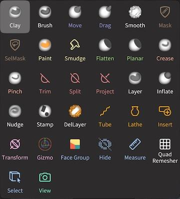
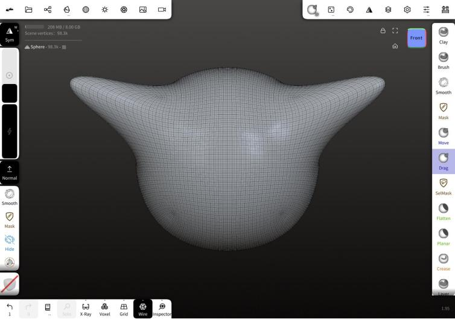
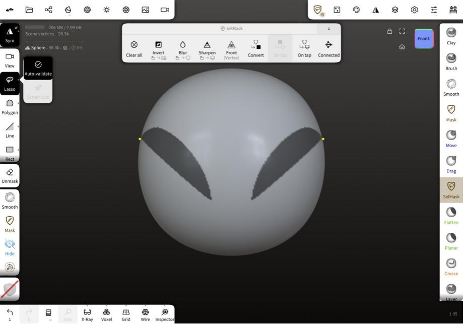
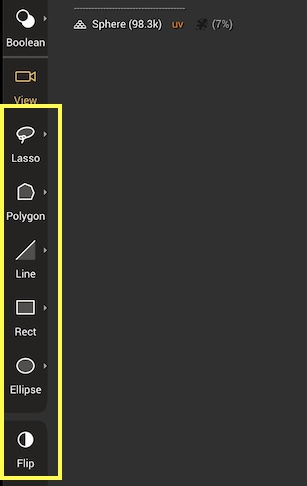

# 認識 Nomad Sculpt

## 歡迎來到 Nomad! 

Nomad 是一款 3D 雕刻應用程式，最適合在配備壓力感應筆的平板電腦上使用，例如 Apple iPad 和 Pencil，或 Samsung Galaxy Tab 配合觸控筆。

它受到 Zbrush 和 Blender 等桌面雕刻應用程式的啟發，專注於易於理解的用戶界面，同時不犧牲功能。如果您之前使用過 3D 雕刻應用程式，Nomad 將會讓您感到非常熟悉。

如果這是您第一次進行 3D 雕刻，那麼了解一些基本知識是很重要的。

## 您的第一個雕刻

當您第一次啟動 Nomad 時，您會看到螢幕上有一個球體。只需在球體上拖動您的觸控筆即可開始雕刻。對稱功能預設為啟用，以便於雕刻。

# 界面

## 導航立方體

一個幫助您顯示您正在查看的雕刻側面，以及跳轉到不同視圖的快捷方式。點擊立方體將視圖跳轉到所點擊的側面。拖動立方體將旋轉視圖。點擊立方體旁的小圖標可以框選當前物件或重置為預設主視圖。

### 三種手勢控制螢幕視圖

拖動以旋轉
滑動以平移
捏合以縮放

## 上方菜單

Nomad 的菜單讓您可以訪問大多數功能。左上方的菜單主要涵蓋場景和物件功能，而右上方的菜單則與工具相關。在較小的螢幕上，這些菜單將會合併以節省空間。

### 狀態
此部分提供有關場景、當前物件、遮罩狀態和記憶體使用情況的信息。

## 左側工具欄
大多數工具的半徑和強度滑桿，其他工具的上下文特定按鈕，以及對稱、工具替代/子模式、遮罩、平滑、工具和繪畫選項的快捷方式。

## 底部工具欄
常用功能的快捷方式如下所述。

## 工具箱

Nomad 的工具可以從這個可滾動的區域訪問。

### 前三個圖標

- 撤銷：     撤回最後的操作
- 重做：     恢復最後的撤銷操作
- 歷史：     訪問歷史選項，在歷史菜單中解釋

# 工具

## 概述

Nomad 擁有許多工具，可以大致分為以下幾類：

- 直接影響物件表面的刷子工具，例如 Clay
- 遮罩工具，將保護表面不受更改，例如 Mask
- 基於選擇的工具，首先繪製 2D 遮罩，然後進行操作，例如 Trim
- 具有自己交互方法的特殊工具，例如 Tube

許多這些工具可以通過 Stroke 菜單自定義不同的刷子行為、壓力、紋理等。

## 工具控制

螢幕左側的面板控制工具的半徑和強度，以及特定於某些工具的熱鍵，這些在每個工具的幫助部分中解釋。

### 提示

許多工具的強度滑桿可以超過 100%，值得嘗試！

## 工具上下文菜單 

右鍵單擊或長按工具將顯示上下文菜單。

此菜單具有以下選項：

- 保存：       保存您對工具所做的任何更改 
- 克隆：      將工具複製到新的工具快捷方式
- 最後保存：  恢復到工具的先前保存版本
- 圖標：       更改工具的圖標 
- 重置：      將工具重置為其默認值

# 常見雕刻工具

## 

Clay 工具對於建立您的雕塑非常有用。

**Sub** 將從您的雕塑中移除材料。

### Sub 如何移除材料

## 

標準刷子。 

**Sub** 將移除材料。

### Sub 如何移除材料

## 

刷子下的區域將粘附於刷子，允許彈性變形。選擇在移動過程中保持，因此如果您將刷子移開，然後將其移回原處，您將不會看到變形。

**Normal** 將沿著表面法線移動刷子下的區域。

### Normal 如何移動

## 

刷子下的區域將粘附於刷子，允許彈性變形。與移動刷子不同，選擇在筆劃過程中不斷更新，因此可以製作更長的蛇形物體，特別是在啟用動態拓撲時。

**Normal** 將沿著表面法線移動刷子下的區域。

### Normal 如何移動

## 

通過平均點位置來平滑區域。此工具高度依賴於多邊形密度。因此，如果您有許多多邊形，平滑效果將不那麼明顯。

替代模式是 **Relax** 模式，僅平滑網格，但試圖保留幾何細節。

### 平滑設置

- #### 邊界上的粘性頂點

對於具有開放邊緣的網格，例如平面，可以平滑角落。啟用此選項將鎖定開放邊緣。

- #### 放鬆

與左側工具欄中的放鬆替代模式相同。

- #### 穩定平滑

試圖使平滑拓撲獨立。這在拓撲密度變化和高平滑強度值的情況下效果最佳。

##### 提示

較高的多邊形密度可能需要將強度提高到 100% 以上。非常高的值（300%、500%）也可以很好地作為雕刻工具，強迫區域迅速變平滑，像用槌子敲打粘土一樣！

## 

此工具允許您遮罩點。被遮罩的頂點無法進行雕刻或上色，這是一種"保護"區域的方法。

**Unmask** 將擦除已繪製的遮罩區域。

### 遮罩設置

在視口頂部將出現一個工具欄，提供額外控制：

- 清除：   清除遮罩					
- 反轉：  反轉遮罩
- 模糊：    模糊遮罩邊緣				
- 銳化： 銳化遮罩邊緣

#### 快速手勢

在按住快速遮罩按鈕時的 4 種手勢：

- 清除：   在背景上拖動
- 反轉：  點擊背景			
- 模糊：    點擊遮罩區域				
- 銳化： 點擊未遮罩區域

遮罩還可以用於提取幾何形狀。**Carve**、**Extract** 和 **Split** 按鈕將從遮罩區域創建新形狀。以下設置提供更多控制：

- #### 厚度
  
  提取的距離。使用 ± 按鈕設置距離為正、負或從表面居中。

- #### 平滑度
  
  將平滑提取形狀的邊緣，對於較高的多邊形計數效果更佳。
  
- #### 提取
  
  在默認模式下的"外殼"模式，像其他 3D 應用中的擠出一樣，將遮罩部分從表面拉出。
  
- #### 分割
  
  將提取的遮罩區域轉換為新形狀，但也對未遮罩區域應用操作。默認操作為"外殼"，導致一個肥厚的擠出遮罩和一個匹配的未遮罩形狀。
  
- #### 切割
  
  在默認模式下，像是將"厚度"量修剪到表面一樣，像切割橙皮一樣。

## 

此工具與 **遮罩工具** 大致相似，主要區別在於您不使用筆劃來繪製遮罩，而是使用 **形狀選擇器**。

選擇器遮罩與 **遮罩** 工具共享相同的工具設置。

### 形狀選擇器

**Trim**、**Split**、**Project**、**Facegroup** 和 **Hide** 工具都使用類似的控制來選擇網格區域，並通過螢幕左側的形狀選擇器面板進行選擇。

- #### 自由手繪
自由手繪的形狀

- #### 多邊形
由曲線和/或直線組合定義的封閉形狀。請參見下面的 **形狀編輯** 以獲取更多信息。

- #### 曲線		（僅限投影） 
自由手繪曲線以進行投影

- #### 路徑		（僅限投影）
由點定義的曲線。請參見下面的 **形狀編輯** 以獲取更多信息。

- #### 線
拖動一條線以定義平面段。默認情況下，它將立即對網格進行操作，如果您不想這樣，請關閉自動驗證（長按或在線圖標上滑動）

- #### 矩形
拖動對角線，這將定義矩形形狀的角。長按或滑動以顯示自動驗證、強制為正方形形狀的選項，以及第一個點為矩形中心的選項。

- #### 橢圓
拖動對角線，這將定義橢圓的大小。長按或滑動以顯示自動驗證、強制為圓形形狀的選項，以及第一個點為橢圓中心的選項。

- #### 翻轉
反轉形狀遮罩或投影工具的方向。

### 形狀編輯

多邊形編輯和曲線編輯的行為相似：

要開始，拖動一條線以定義 2 個點，然後從線的中間拖出以定義多邊形或曲線。單擊點以在平滑和尖銳之間切換。單擊並拖動曲線或線段以創建新點。要刪除一個點，將一個點拖入其相鄰點，直到它變紅。多邊形或路徑圖標右上角的垃圾桶圖標將刪除形狀。

## 常見問題及解決方案

### 應用崩潰
- **解決方案：** 確保您的設備有足夠的存儲空間，關閉其他正在運行的應用程式，並重新啟動應用程式。

### 性能問題
- **解決方案：** 降低模型複雜性，降低刷子解析度，並清除撤銷歷史。

### 工具無法響應
- **解決方案：** 檢查工具是否正確選擇，並確保應用程式已更新到最新版本。

### 匯出問題
- **解決方案：** 驗證文件格式，並確保模型不過於複雜以符合匯出設置。 