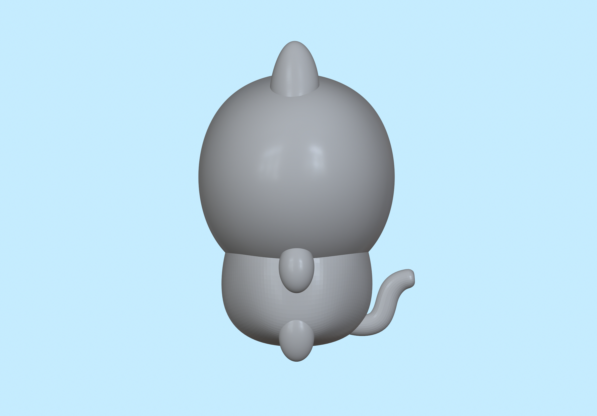

# Project 02: Create Your Own Chiikawa

This project will guide you through creating a Chiikawa 3D model using Nomad Sculpt. Follow these steps to create your own.

If you need basic Nomad Sculpt tutorials, please refer to the [Nomad Sculpt Guide](/resources/getting-to-know-nomad-sculpt/).

## Step 1: Preparation

1. Open Nomad Sculpt: 

    * Launch the application and create a new project.

2. Basic Shape: 

    * Use the sphere in the scene as the base shape, which will become Chiikawa's head.

3. Reference Image: 

    * Import Chiikawa's front reference image, adjust the sphere transparency (Overlay) and image position.

## Step 2: Basic Modeling

1. Adjust View: Use gestures to move the sphere in the scene to overlap with Chiikawa's head in the reference image for easier modeling.

    > Note: Don't use the "Gizmo" move function to avoid affecting the symmetry function later.

2. Adjust Head Shape:

    * Use "Gizmo" transform function to adjust the overall shape of the sphere
    * Use "Move" tool to fine-tune the sphere shape

    > Note: Keep Symmetry function enabled to ensure left-right symmetry

3. Create Body:

    * Add a new shape through "Add" to create Chiikawa's body
    * Use "Gizmo" move function to position the new shape below the head

4. Adjust Body Shape:

    * Use "Gizmo" transform function to adjust the overall shape
    * Click "Validate" then use "Move" tool for detail adjustments

5. Create Ears, Tail, and Limbs:

    * Add new shapes for each part
    * Use "Gizmo" move and rotate functions to adjust position and pose
    * For symmetrical parts, click "Mirror" before "Validate"

    > Note: Click "Save" for saving your working

## Step 2.5: Creating Other Chiikawa Characters

### Save As New File

1. Click "File" → "Save As"
2. Save the current model as a new file (e.g., Chiikawa_hachiware)

### Reuse Model

Directly use the head and body structure completed in Step 2, no need to recreate.

### Modify Ear Shape

1. Select original ear components and use "Delete" tool to remove old ears
2. Add sphere or cylinder through "Add"
3. Use "Gizmo" scale and stretch functions, or "Move" to adjust into different shapes
4. Symmetry operations:

    * Turn off "Symmetry" for asymmetric designs

    * For symmetry, create one side first then use "Mirror" to copy the other side

### Add/Adjust Tail

1. Select original tail component and use "Delete" tool to remove old tail
2. Add → "Tube" behind the body for the tail
3. Draw tail movement shape/pattern:

    * Drag white points to change shape/pattern

    * Can add white points on segments

4. Adjust tube parameters:

    * Enable "Radius" to adjust thickness

### Positioning and Deformation

1. Use "Gizmo" for "Move" function to position the tube behind the body
2. Use "Scale" tool to adjust overall thickness for shape variation
3. Advanced details: 

    * Use "Clay" or "Inflate" tools to sculpt tail characteristics
    
    > Note: Click "Validate" before using the tools

### Quick Proportion Check

Switch viewing angles to verify the proportions between ears, tail, and body to avoid size imbalance.

    
    

## Step 3: Adding Details

1. Sculpt Facial Details:

    * Use "Subdivide" to increase mesh density

    * Sculpt eyes and mouth positions and details with "Brush" and "Crease"

    * Add spheres for eyeballs, adjust size and position

    * Use "Smooth" to remove sharp edges

    * Use "Inflate" to enhance cheek roundness

## Step 4: Adding Color and Visual Post-processing

1. Color Your Chiikawa:

    * Use "Paint" tool

    * Adjust roughness and metallic properties for different textures

2. Post-processing:

    * Adjust overall visual effects (like Color Grading)

    * Enable "Ambient Occlusion" to enhance shadows and depth

## Step 5: Completion and Export

1. Check Model: 

    * Carefully inspect every detail of the model

2. Export Model:

    * For 3D printing, select all components

    * Use "Boolean" to merge them into one piece

    * Export the completed Chiikawa model in required format (.stl/.obj)

## Practice

    

        <h3>Level 1: Basic Chiikawa</h3>
        
Follow the main tutorial steps

        
    

    

        <h3>Level 2: Custom Creation</h3>
        
Create your own unique character

        
    

## Conclusion

Congratulations on creating your Chiikawa! You can now explore more advanced features or start creating different characters. Happy modeling!
