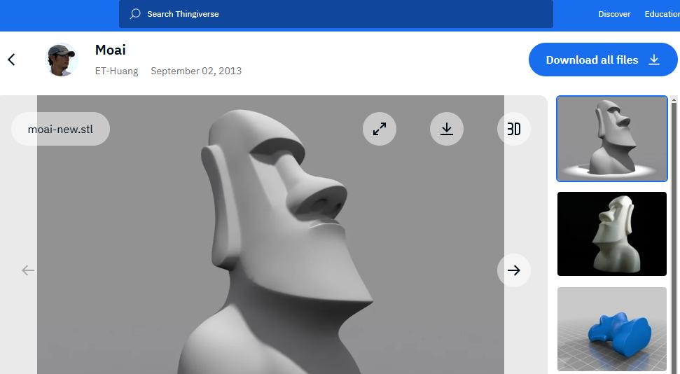
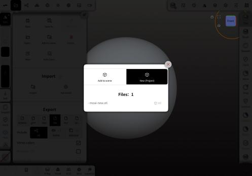
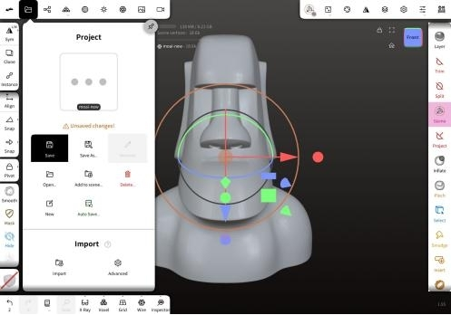
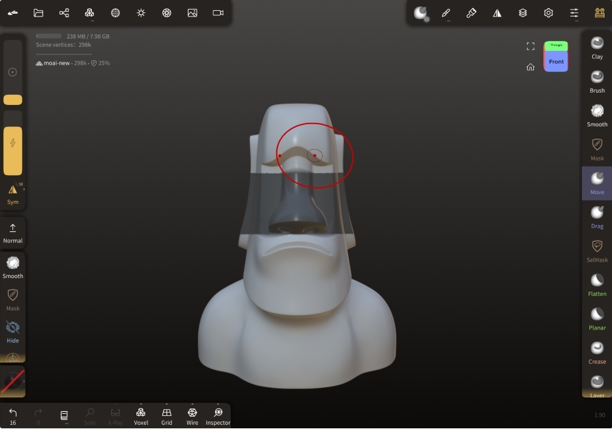
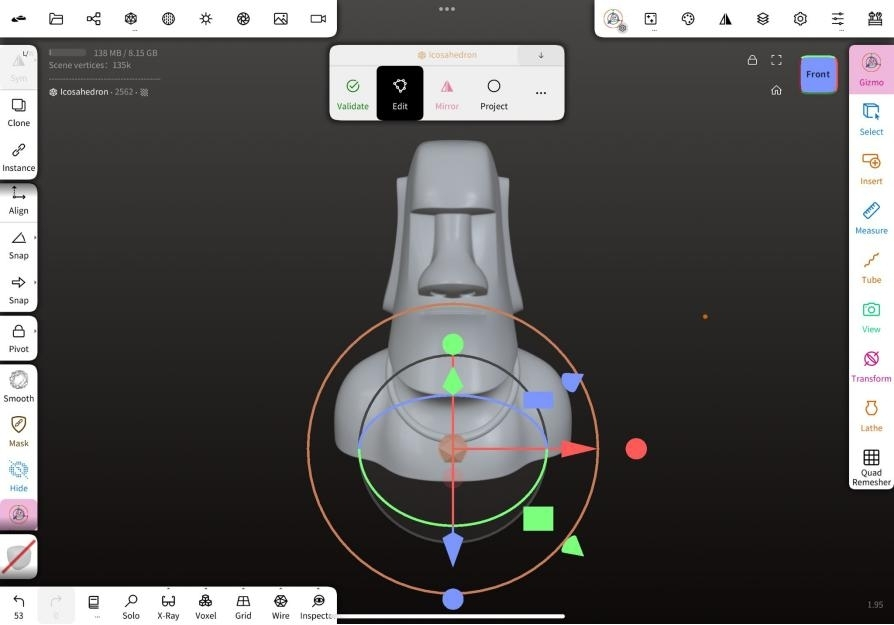

# 專案 01: 創建你的 Moai

這個專案指導你如何使用我們的軟件創建和修改 3D Moai 模型。請按照以下步驟導入、修改和保存你的 Moai。

如果你需要基本的 Nomad Sculpt 教學，請參考 [Nomad Sculpt 指南](/zh_HK/resources/getting-to-know-nomad-sculpt/)。

## 準備

[從 Thingiverse 下載免費的 Moai 3D 文件](https://www.thingiverse.com/thing:144668)，並將其保存在平板電腦上。

## 導入 Moai

1. 點擊頂部菜單的「文件」
2. 從下拉菜單中選擇「導入」
3. 選擇 Moai 文件
4. 點擊「新建（專案）」

## 保存你的 Moai

1. 在工具箱中選擇「Gizmo」以旋轉 Moai
2. 在工具箱中選擇工具以修改你的 Moai
3. 將你的 Moai 保存為 3D 文件專案

## 練習

### 等級 1

### 等級 2

## 參考

### 編號 001

**解決方案：**

1. 在工具箱中使用「SelMask」
2. 使用「Rect」選擇器遮罩眼睛
3. 使用「Move」改變嘴巴
4. 使用「Smooth」去除顆粒感
5. 清除遮罩

### 編號 002

**解決方案：**

1. 在工具箱中使用「SelMask」
2. 使用「Rect」選擇器遮罩眼睛
3. 使用「Move」改變眉毛和嘴巴
4. 使用「Smooth」去除顆粒感
5. 清除遮罩

### 編號 004

**解決方案：**

1. 點擊頂部菜單的「場景」
2. 點擊「添加...」
3. 從「Primitive」中選擇一個形狀
4. 在工具欄中使用「Gizmo」進行移動
5. 點擊原始工具欄上的「Mirror」以切換放置鏡像重複器在原始上方

### 編號 005

**解決方案：**

1. 點擊頂部菜單的「場景」
2. 點擊「添加...」
3. 從「Primitive」中選擇一個形狀
4. 在工具欄中使用「Gizmo」進行移動
5. 在工具欄中使用「Gizmo」進行縮放

## 結論

恭喜你創建了你的 Moai！你現在可以探索更高級的功能或開始一個新專案。祝你建模愉快！

## 步驟 2：基本造型

* 調整畫面：透過使用手勢將畫面中的球體移到與參考圖片中 Chiikawa 的頭部重疊，方便按照形狀製作。
   - 留意：非使用"軸向變換（Gizmo）"的移動功能，避免影響後續使用對稱功能。

* 調整頭部形狀：
   * 使用"軸向變換（Gizmo）"的變形功能調整球體的整體形狀
   * 使用"移動（Move）"工具仔細調整球體的形狀
   - 留意：對稱（Symmetry）功能保持開啟，確保左右對稱 